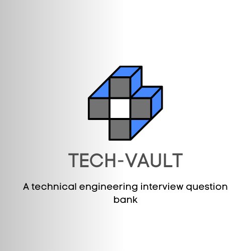

[](https://opensource.org/licenses/Apache-2.0)
[](http://makeapullrequest.com)

# Tech Vault 🛠️

<p align="center">
  
</p>


Note: A documentation of carefully curated technical engineering questions & challenges by experienced Engineers who have conducted many interviews. These are amongst popular and important engineering questions to test knowledge of candidates in interviews. 

Any questions taken from external references are referenced [below](#references).  

## Table of Contents

- [X] [Vision 🚀](#vision)
- [X] [What is different in this repo compared to others? 🌟](#what-is-different-in-this-repo-compared-to-others)
- [X] [Contributing 🖊️](#contributing)
- [X] [DevOps Challenges](./devops-challenges/README.md)
- [X] [Coding Challenges](./coding-challenges/README.md)
- [X] [DevOps 🛠](#devops)
    - [Linux 🐧](#small_blue_diamond-linux)
    - [Networking 🌐](#small_blue_diamond-networking)
    - [Git](#small_blue_diamond-git)
    - [AWS 🌩️](#small_blue_diamond-aws)
    - [Azure 🌩️](#small_blue_diamond-azure)
    - [Terraform 🏗️](#small_blue_diamond-terraform)
    - [Docker & K8s 🐳 🎻](#small_blue_diamond-docker--k8s)
    - [Ansible 🔧](#small_blue_diamond-ansible)
    - [CI/CD 🛠️](#small_blue_diamond-cicd)
    - [DevOps methodology, practices, & Agile](#small_blue_diamond-devops-methodology-practices--agile)
- [X] [System Design 🍥](#system-design)
    - [CDN & Caching ⚡](#small_blue_diamond-cdn--caching)
    - [Databases 📊](#small_blue_diamond-databases)
- [X] [Software Engineering](#software-engineering)
    - [General](#small_blue_diamond-general)
    - [Golang](#small_blue_diamond-golang)
    - [Python](#small_blue_diamond-python)
    - [Java](#small_blue_diamond-java)
    - [JavaScript](#small_blue_diamond-javascript-tsnodejs)
- [X] [Data](#data)
    - [Data Modelling & Schemas](#data-modelling-and-schemas)
    - [Data Architect](#data-architect)
    - [Data Engineering](#data-engineering)
    - [SQL](#sql)
    - [ETL & Data Pipelines](#etl-pipelines)
- [X] [Machine Learning 🤖](#machine-learning)
- [X] [Cyber Security & InfoSecurity 🛡️](#cyber-security--info-security)
- [X] [Interpersonal skills](#interpersonal--behavioural-questions)
- [X] [References](#references)

## Vision

- Coming from a non-technical background and without experience can be difficult for many. So my Team & I have decided to create this project where all, non-technical and technical tech professionals, can have a place of reference to technical interview questions and interview prep. This is maintained by a lovely community. If you wish to contribute, feel free to do so. Read this for more info >> [How to Contribute](#contributing-🖊️s) 

## What is different in this repo compared to others?

1️⃣ Real questions asked by and of our Engineers (obviously reworded questions)

2️⃣ Scenario-based questions mirroring actual interviews

3️⃣ Up-to-date and relevant topics

4️⃣ Ongoing updates by experienced Engineers in their fields.

5️⃣ Hands-on questions that are similar to real-life scenarios aka DevOps Challenges
  - I have created these for that want more hands-on experience when it comes to DevOps.
  - 

6️⃣ [Random Question Generator](./misc/README.md)

7️⃣ [Tech Vault CLI tool](https://github.com/moabukar/tech-vault-cli)

## Contributing 🖊️

- To contribute, please read our [Contributing Guidelines](CONTRIBUTING.md). For any fixes, updates or new additions, please make a pull-request (PR). Thank you!

## DevOps 🛠

### :small_blue_diamond: Linux

<details>
<summary>What is Linux and difference between UNIX and Linux?</summary>

Linux is an open-source operating system based on the UNIX architecture. It was created by Linus Torvalds in 1991. UNIX, on the other hand, is a family of operating systems that was developed in the late 1960s at Bell Labs. The main differences between UNIX and Linux are:

- **License:** UNIX is proprietary, while Linux is open-source and free to use.
- **Development:** UNIX is developed by a few organizations (like IBM, Sun Microsystems, and HP), while Linux has a widespread community-driven development process.
- **Portability:** Linux is more portable and can be used on a wide range of hardware, whereas UNIX is limited to specific hardware platforms.
- **User base:** Linux has a broader user base, including personal computers, servers, and embedded systems, while UNIX is primarily used in enterprise environments.
</details>

<details>
<summary>What is the Linux kernel?</summary>

The Linux kernel is the core component of the Linux operating system. It is responsible for managing the system's resources, providing an interface between hardware and software, and facilitating essential tasks such as memory management, process scheduling, and input/output (I/O) operations.

</details>

<details>
<summary>What are inodes in Linux?</summary>

Inodes in Linux are data structures that store important information about files on a file system. Each file or directory in a Linux file system has an associated inode that contains metadata such as the file's size, permissions, ownership, timestamps, and the location of the file's data blocks on the disk.

When you create a file or directory, the file system assigns a unique inode number to it. The inode number serves as an identifier for the file, allowing the file system to access the inode's information and manage the file accordingly.

Here's a summary of what inodes store:

- File type (regular file, directory, symbolic link, etc.)
- File permissions (read, write, execute)
- Ownership (user and group)
- Timestamps (creation, modification, and access times)
- File size
- Number of hard links to the file
- Location of the file's data blocks on the disk

It's important to note that inodes don't store the file's name or the actual file data. The file name is stored in the directory that contains the file, which associates the name with the inode number. The actual file data is stored in separate data blocks on the disk, and the inode points to these blocks.

Inodes play a crucial role in managing files and directories within a Linux file system, providing an efficient way to access and manipulate file metadata.

</details>


<details>
<summary>Explain the Linux boot process</summary>

The Linux boot process consists of several stages that initialize the system and load the operating system. Here's a brief overview of the key steps:

BIOS/UEFI: When the computer is powered on, the BIOS (Basic Input/Output System) or UEFI (Unified Extensible Firmware Interface) performs initial hardware checks and locates the boot device.

Bootloader: The bootloader (e.g., GRUB) loads from the boot device and presents the available operating systems to the user. It then loads the Linux kernel and initial RAM disk (initrd) into memory.

Kernel initialization: The Linux kernel initializes hardware, sets up memory management, starts essential processes, and mounts the initial RAM disk, which contains essential drivers and tools needed during the boot process.

Root file system: The kernel switches the root file system from the initial RAM disk to the actual root partition on the disk, typically identified by its UUID or device name (e.g., /dev/sda1).

Init process: The first user-space process, called init (e.g., Systemd, SysVinit, or Upstart), starts and manages system services and processes during the boot process and the system's runtime.

Runlevel/target: Init process initializes the predefined runlevel (SysVinit) or target (Systemd), which determines the services and processes to run at startup.

Login prompt: Once all services and processes specified in the runlevel/target have started, the system displays a login prompt, indicating that the boot process is complete and the system is ready for use.

</details>

<details>
<summary>What is a zombie process?</summary>

A zombie process, also known as a defunct process, is a process that has completed its execution but still remains in the process table. This happens because the parent process has not yet read the child process's exit status, which is required to clean up the child process's resources and remove its entry from the process table.

Zombie processes don't consume any system resources, except for the process table entry, which includes the process ID (PID) and the exit status. The operating system keeps this information so that the parent process can eventually retrieve the exit status and perform the necessary clean-up.

More info on zombie processes below:

Typically, a well-behaved parent process will use the wait() or waitpid() system call to collect the exit status of its child processes. However, if the parent process doesn't do this, either due to a programming error or because the parent is still running and hasn't reached the point where it collects the exit status, the child process becomes a zombie.

Zombie processes are usually harmless, but if a system accumulates a large number of them, it could exhaust the available PIDs and prevent new processes from being created. To resolve this issue, the parent process should be fixed to correctly handle its child processes' exit status, or if the parent process is unresponsive or terminated, a system reboot might be necessary.

</details>

<details>
<summary>Difference between soft links and hardlinks?</summary>

Soft links and hard links are two types of file links in a Unix-like file system, such as Linux. They serve different purposes and have distinct characteristics:

**Soft Link (Symbolic Link):**

- A soft link is a separate file that points to the target file or directory by storing its path.
- If the target file is deleted, the soft link becomes a "dangling" link, pointing to a nonexistent file.
- Soft links can span across different file systems and partitions.
- Soft links can link to directories as well as files.
- When a soft link is created, the link count of the target file doesn't change.
- Soft links have different inode numbers than their target files.

**Hard Link:**

- A hard link is a direct reference to the data on the disk, sharing the same inode as the target file.
- If the target file is deleted, the hard link still points to the data, and the data remains accessible until all hard links to it are removed.
- Hard links can only be created within the same file system or partition.
- Hard links cannot link to directories, only to files.
- When a hard link is created, the link count of the target file increases by one.
- Hard links have the same inode numbers as their target files.

In summary, a soft link is a more flexible but less reliable type of link that can point to files or directories across file systems, while a hard link is a more robust link that directly references the file's data, but is limited to the same file system and cannot link to directories.

</details>

<details>
<summary>What are namespaces and c-groups?</summary>

Namespaces and cgroups (control groups) are two Linux kernel features that play a crucial role in implementing process isolation and resource management, especially in containerization technologies like Docker.

**Namespaces:**

Namespaces are a feature that provides process isolation by creating separate instances of certain system resources, which can only be accessed by processes within the same namespace. This isolation helps ensure that processes running in one namespace don't interfere with processes in another namespace

There are several types of namespaces, including:

- PID namespace: Isolates process IDs, allowing each namespace to have its own set of PIDs.
- Mount namespace: Isolates the file system mount points, so that each namespace has its own mount tree.
- Network namespace: Isolates network resources, providing each namespace with its own network stack, including interfaces, routes, and firewall rules.
- IPC namespace: Isolates inter-process communication resources, preventing processes in one namespace from communicating with processes in another namespace.
- UTS namespace: Isolates system identifiers like hostname, allowing each namespace to have its own unique hostname.
- User namespace: Isolates user and group ID mappings, enabling each namespace to have its own set of user and group IDs.

**Cgroups (Control Groups):**

Cgroups are a kernel feature that enables the management and limitation of system resources, such as CPU, memory, and I/O, for a group of processes. Cgroups help ensure fair distribution of resources, prevent resource starvation, and enforce limits on resource usage. Some of the key features of cgroups include:

- Resource limiting: Allows setting limits on resource usage for a group of processes, such as maximum CPU usage, memory consumption, and disk I/O bandwidth.
- Prioritization: Enables setting priorities for resource allocation among different cgroups, helping to ensure that critical processes receive sufficient resources.
- Accounting: Collects resource usage statistics for processes in a cgroup, which can be useful for monitoring, profiling, and billing purposes.
- Control: Provides a mechanism to start, stop, or freeze processes in a cgroup, allowing for better management of process groups.

In combination, namespaces and cgroups provide the necessary isolation and resource management capabilities required to build and run containers, enabling multiple containers to coexist on the same host without interfering with each other or consuming excessive resources.

</details>

<details>
<summary>What are symbolic links?</summary>

Symbolic links, also known as soft links or symlinks, are a type of file link in Unix-like file systems, such as Linux. A symbolic link is a special file that points to another file or directory by storing its path. Symbolic links serve as a reference to the target file or directory, allowing users and applications to access the target through the link.

Symbolic links are useful in various scenarios, such as creating shortcuts, linking to files or directories in different locations, or maintaining multiple versions of a file or directory. Some key characteristics of symbolic links are:

Symbolic links can point to files or directories, and they can span across different file systems and partitions.
If the target file or directory is moved or deleted, the symbolic link becomes a "dangling" link, pointing to a nonexistent location.
Symbolic links have different inode numbers than their target files or directories.
When listing files with the ls command, symbolic links are usually indicated by an "l" at the beginning of the file permissions and an arrow (->) pointing to the target file or directory.

To create a symbolic link in Linux, you can use the ln command with the -s option, followed by the target file or directory and the desired symlink name:

```bash
ln -s target_file symlink_name

Example:

ln -s /path/to/original/file.txt link_to_file.txt

This command creates a symbolic link named link_to_file.txt that points to the file located at /path/to/original/file.txt.
```

</details>

<details>
<summary>What are the different types of permissions in Linux?</summary>

In Linux, there are three main types of permissions for files and directories, which determine how users can interact with them. These permissions are classified into categories based on the user's relationship to the file or directory: owner, group, and others (sometimes referred to as "world" or "public"). The three types of permissions are:

Read (r): Read permission allows a user to view the contents of a file or list the contents of a directory. For files, this means the user can open and read the file. For directories, the user can view the names of files and subdirectories within that directory.

Write (w): Write permission allows a user to modify the contents of a file or make changes within a directory. For files, this means the user can edit, append, or delete the file's content. For directories, the user can create, rename, or delete files and subdirectories within that directory. Note that deleting or renaming files within a directory requires write permission on the directory itself, not the individual files.

Execute (x): Execute permission allows a user to run a file as a program or script, or enter and access a directory. For files, this means the user can execute the file if it is a binary executable or script with a proper interpreter (e.g., a shell script or Python script). For directories, the user can change their current working directory to that directory, and access files and subdirectories within it.

These permissions are usually represented using a combination of letters (r, w, x) and dashes (-) for each of the three categories: owner, group, and others. For example, the permission string -rwxr-xr-- indicates:

- The first character - indicates it's a regular file (a d would indicate a directory).
- The owner has read (r), write (w), and execute (x) permissions: rwx.
- The group has read (r) and execute (x) permissions, but not write permission: r-x.
- Others have only read (r) permission: r--.

Alternatively, permissions can also be represented using octal notation (base-8), where read, write, and execute permissions are assigned values of 4, 2, and 1, respectively. The permissions are then represented by a three-digit number, with each digit corresponding to the owner, group, and others. For example, the permission string -rwxr-xr-- can be represented as 754 in octal notation.

</details>

<details>
<summary>What is swap space?</summary>

Swap space is a dedicated area on a storage device (such as a hard drive or SSD) that functions as an extension of a computer's physical memory (RAM). It is used by the operating system to temporarily store data that does not fit into RAM or when the system experiences memory pressure due to high RAM utilization.

When the operating system needs more memory than is physically available, it can move the least recently used or less important data (called pages) from RAM to the swap space. This process is called "paging" or "swapping out." By doing so, it frees up space in RAM for more critical or frequently accessed data. If the swapped-out data is required again, the operating system will move it back into RAM, possibly swapping out other data in the process. This is called "swapping in."

Swap space can be implemented as a dedicated swap partition or a swap file. In Linux, you can manage swap space using commands such as swapon, swapoff, and mkswap. To check the current swap space usage on a Linux system, you can use the free or swapon -s commands.

</details>


<details>
<summary>What is chmod, chown and chgrp in Linux?</summary>

**chmod**
chmod (change mode) is a command used to change the permissions of a file or directory. You can set read, write, and execute permissions for the owner, group, and others. Permissions can be represented in octal notation (numeric) or using symbolic notation (letters).

Example: For example, to give the owner read, write, and execute permissions, the group read and execute permissions, and others only read permission, you would use:
- Using octal notation: `chmod 754 file.txt`
- Using symbolic notation: `chmod u=rwx,g=rx,o=r file.txt`

**chown**

chown (change owner) is a command used to change the ownership of a file or directory. You can specify a new owner and an optional new group for the file or directory.

Example: For example, to change the owner of file.txt to the user john and the group to developers, you would use:

`chown john:developers file.txt`

**chgrp**

chgrp (change group) is a command used to change the group assignment of a file or directory. You can specify a new group for the file or directory.

Example: For example, to change the group of file.txt to the group developers, you would use:

`chgrp developers file.txt`


</details>

<details>
<summary>What are cronjobs?</summary>

Cronjobs, also known as cron jobs or simply cron, are scheduled tasks that run automatically at specified intervals on Unix-like operating systems, such as Linux. The term "cron" comes from the Greek word "chronos," which means "time." Cronjobs are commonly used for automating repetitive tasks, performing system maintenance, running periodic backups, and other similar activities.

Cronjobs are managed by a daemon called "cron," which runs in the background and executes the scheduled tasks. The configuration for cron jobs is stored in a series of files called "crontabs" (short for "cron tables"). Each user on the system can have their own crontab, and there is also a system-wide crontab.

For example, a cron job that runs every day at 3:30 AM would have the following entry in the crontab:

`30 3 * * * /path/to/command arg1 arg2`

To manage cron jobs, you can use the crontab command with various options:

- crontab -l: List the current user's cron jobs.
- crontab -e: Edit the current user's cron jobs using the default text editor.
- crontab -r: Remove the current user's cron jobs.
- crontab -u USER: Perform an operation (list, edit, or remove) on the specified user's cron jobs (requires root privileges).

</details>

**Commands (basic & advanced):**

<details>
<summary>What does chmod +x FILENAME do?</summary>

The command chmod +x FILENAME is used to add execute permissions to a file in a Linux or Unix-like system. By adding execute permissions, you allow the file to be run as an executable or script, provided it has the appropriate format and interpreter (e.g., a shell script, Python script, or compiled binary). The +x option specifically grants execute permission to the owner, group, and others (all users).

For example, if you have a script named myscript.sh and you want to make it executable, you would run:

`chmod +x myscript.sh`

</details>

<details>
<summary>Which command will show you free/used memory?</summary>

the free command is used to display information about free and used memory. The command provides details on total, used, free, shared, and available memory, as well as swap space usage.

To use the free command, simply type free in the terminal, followed by any desired options. Some common options include:

- -b: Display memory usage in bytes.
- -k: Display memory usage in kilobytes (default).
- -m: Display memory usage in megabytes.
- -g: Display memory usage in gigabytes.
- -h: Display memory usage in a human-readable format, automatically choosing the appropriate unit (e.g., B, K, M, or G).
- -t: Display a line containing the total amount of physical memory and swap space.
- -s N: Continuously display memory usage information, updating every N seconds.

For example, to display memory usage in a human-readable format, you would run:

`free -h`

</details>

<details>
<summary>Which command will show me the current directory I am in?</summary>

`pwd`

</details>

<details>
<summary>How can I terminate an on going process?</summary>

`kill -9 PID`

</details>


<details>
<summary>Write the command that will display all .yaml files including permissions of each file? ()</summary>

`find . -type f -name "*.yaml" -exec ls -l {} \`;

</details>


<details>
<summary>How can I found the status of a process?</summary>

`ps -p <PID>` >> for 1 process

`ps aux` >> display a detailed list of all running processes on the system

</details>

<details>
<summary>What is the command to show all open ports?</summary>

`netstat -tuln`

</details>


<details>
<summary>How do you find the process ID of a running process in Linux?</summary>

- `ps -ef | grep <process_name>`
- `ps -ef | grep chrome`


</details>

<details>
<summary>How do you find the dependencies of a package in Linux?</summary>

Debian based (Ubuntu):
- `apt depends <packagename>`
- `apt-cache depends <packagename>`

Red Hat based (Fedora, CentOS)
- `dnf repoquery --requires <packagename>`


</details>

**Advanced:**

<details>
<summary>Does free memory exist on Linux?</summary>

On Linux systems, the concept of "free memory" may be a bit nuanced due to how Linux manages memory. While the term "free memory" is commonly used, Linux uses a sophisticated memory management system that maximizes the utilization of available memory for optimal performance.

In Linux, free memory refers to the memory that is not currently being used by any active processes or cached by the system. However, this does not mean that the memory is entirely unused or wasted. Linux takes advantage of available memory by utilizing it for disk caching, buffering, and other optimizations to improve system performance.

When you check the memory usage using tools like free or top, you will see several memory-related metrics, including "free," "used," "buffers," and "cache." These metrics represent different aspects of memory usage:

</details>

<details>
<summary>How can I check if a server is down?</summary>

1) The ping command is a simple and widely used tool to check the connectivity between your Linux system and a remote server

`ping <server_address>`

2) The telnet command allows you to establish a connection to a specific port on a server. By attempting to connect to a server's port, you can determine if it's up and accepting connections

`telnet <server_address> <port>`

3) If the telnet command is not available on your system, you can use nc (netcat), which provides similar functionality. 

`nc -zv <server_address> <port>`

</details>

<details>
<summary>What is inside /proc?</summary>

The `/proc` directory is a virtual filesystem that provides an interface to access process-related information dynamically. It contains various files and folders that provide information about running processes and system configuration.

- It holds details about each running process in separate folders identified by their process IDs (PIDs).
- It also provides system-wide information such as CPU details, memory usage statistics, network-related data, and kernel parameters.
- The content of /proc changes dynamically based on the current state of the system and running processes.

</details>

<details>
<summary>A process on the system can no longer log files, what can I do?</summary>

- **Check file permissions**: Ensure that the process has the necessary permissions to write to the log files or directories. Verify the ownership and permissions of the log files, and make sure they are writable by the user or group associated with the process
  
- **Verify available disk space**:  Insufficient disk space can prevent the process from writing to log files
- **Restart the process**
- **Check log file size limit**: Some processes have limits on the maximum size of log files they can generate
- **Check file system or disk errors**: Perform a file system check (fsck) on the relevant file system or check for disk errors using appropriate tools. File system errors or disk issues can sometimes interfere with file writing.
- **Verify logging configuration**: Ensure that the log file path and other settings are correctly specified
- **Check for system-level logging issue**: If multiple processes are unable to log files, there might be a system-wide issue with the logging infrastructure. Check system logs (e.g., /var/log/syslog or /var/log/messages) for any relevant error messages or indications of logging problems.

</details>

<details>
<summary>What is LILO?</summary>

- LILO, short for "LInux LOader," is a boot loader program used in older versions of Linux distributions.
- LILO's main function is to load the Linux kernel into memory and initiate the boot process.It presents a menu to the user, allowing the selection of the desired kernel or operating system to boot (if multiple operating systems are installed).
- LILO writes itself to the Master Boot Record (MBR) of the disk, overwriting the existing boot loader.
- Its configuration file (/etc/lilo.conf) specifies the location of the Linux kernel image and boot parameters.
- LILO has been largely replaced by other boot loaders, particularly GRUB (Grand Unified Bootloader), which offers more advanced features and flexibility.
- GRUB has become the default boot loader for many Linux distributions.

</details>

<details>
<summary>What are syscalls in Linux and how do they work?</summary>

- Syscalls are the interface between user-space applications and the kernel in Linux.
- They allow user programs to request services and access operating system resources.
- User programs invoke syscalls using special instructions, triggering a switch from user mode to kernel mode.

</details>

<details>
<summary>What is no route to host?</summary>

- "No route to host" is an error message that can occur in Linux when attempting to establish a network connection to a remote host

</details>

<details>
<summary>What is the difference between a hard link and a symbolic link in Linux? (WITH hands-on example)</summary>

**Hard Link**

- Direct reference to an existing file or directory.
- Creates a new name or entry pointing to the same data.
- Both the original file and hard link refer to the same underlying data.
- Deleting one does not affect the other.
- Essentially multiple names for the same file.

**Symbolic Link (Symlink)**

- Special file that acts as a pointer or shortcut.
- Contains the path or location of the target file or directory.
- Resolves the path to the target when accessed.
- Can point to files or directories on different file systems or even non-existent or moved targets.
- Deleting the original file or directory doesn't automatically delete the symlink.
- Symlink becomes "broken" if the target is deleted or moved.

**Example**

Assume we have a file named "original.txt" with the content "Hello, world!" in the directory /home/user/.

Hard Link:
  - Create a hard link named "hardlink.txt" to "original.txt" using the ln command: `ln /home/user/original.txt /home/user/hardlink.txt`
  - Both "original.txt" and "hardlink.txt" now refer to the same file and share the same data.
  - If you modify the content of "original.txt", the changes will be visible when accessing "hardlink.txt" and vice versa.
  - Deleting either "original.txt" or "hardlink.txt" will not affect the other file.

Symbolic (soft) link:
  - Create a symbolic link named "symlink.txt" to "original.txt" using the ln command with the -s option: `ln -s /home/user/original.txt /home/user/symlink.txt`
  - "symlink.txt" is a separate file that acts as a pointer to "original.txt".
  - If you modify the content of "original.txt", the changes will be reflected in "symlink.txt".
  - Deleting "original.txt" will not automatically delete "symlink.txt", but accessing "symlink.txt" will result in a broken link if the target is not available.

In summary, with a hard link, you have multiple names for the same file sharing the same data, while with a symbolic link, you have a separate file acting as a pointer to another file or directory.

</details>

**Linux Internals & Advanced (Scenario based questions):**

<details>
<summary>Explain the linux boot process (detailed) </summary>

- BIOS/UEFI: When you power on the computer, the Basic Input/Output System (BIOS) or Unified Extensible Firmware Interface (UEFI) firmware is invoked. It performs hardware initialization, self-tests, and determines the boot device.

- Bootloader: GRUB (the most common Linux bootloader) loads the operating system into memory.

- Kernel Initialization: Once the bootloader hands off control, the Linux kernel is loaded into memory. It starts executing from its entry point. The kernel is responsible for managing system resources, such as memory, processes, devices, and file systems.

- Init Process: The first user-space process, known as the init process, is started by the kernel. The init process has a process ID (PID) of 1 and is responsible for initializing the system further. In modern Linux distributions that use systemd as the init system, the init process is replaced by the systemd process.

- Init System/Services: System services and daemons are launched.

- Login Manager: A login screen or prompt appears for user authentication.

- User Session: After login, the user's session starts with the desktop environment.

In summary, the boot process involves firmware initialization, bootloader loading the OS, kernel taking control, system initialization, login prompt, and user session start.

</details>

<details>
<summary>A process on the system can no longer log files, how would you debug?</summary>

- **Check File Permissions**: Verify that the process has proper permissions to write to the log files or directories. Ensure that the file permissions and ownership are correctly set to allow the process to write logs.
- **Review Log File Configuration**: Check the configuration file (e.g., /etc/rsyslog.conf or /etc/syslog-ng/syslog-ng.conf) to ensure that the log files and their destinations are correctly defined.
- **Check Disk Space**: Insufficient disk space can prevent file logging. Use the df command to check the available disk space. Ensure that the filesystem containing the log files has enough free space to accommodate new logs.
- **Check System Logs**: Review the system logs (/var/log/syslog, /var/log/messages, etc.) for any relevant error messages or indications of issues related to the logging process. Look for log entries related to the process and check if any error messages are reported.
- **Restart the Logging Service**: Restart the logging service associated with the process (if you use rsyslog for logging) >> `sudo systemctl restart rsyslog`

</details>

<details>
<summary>How can I check if a Linux system is healthy?</summary>

- **System Resource Usage**: 
  - Monitor CPU usage: Use tools like `top` or `htop` to check CPU usage and identify any processes consuming excessive CPU resources.
  - Check memory usage: Use commands like `free` or `top` to examine memory usage and ensure sufficient free memory is available.
  - Monitor disk usage: Use `df` or `du` commands to check disk space utilization and identify any partitions nearing capacity limits.

- **System Services and Processes:**: 
  - Check running processes: Use `ps` or `top` to view running processes and ensure critical services are active.
  - Verify system services: Use service management tools like `systemctl` (systemd) or `service` (init) to check the status of essential services.

- **System Logs**: 
  - Review system logs: Examine log files in `/var/log/` (e.g., `/var/log/syslog`, `/var/log/messages`) for any error or warning messages related to system components, applications, or hardware.
  - Monitor log files in real-time: Use the `tail` command with the -f option to track log files as new entries are added.

- **Network Connectivity**: 
  - Check network interfaces: Use `ifconfig` or `ip` command to verify the status and configuration of network interfaces.
  - Test network connectivity: Use `ping` or `traceroute` to test connectivity to remote hosts or check for network latency or packet loss.

- Hardware monitoring?
- Security and updates?
- Backup and recover?

</details>

<details>
<summary>What happens when you type "ls" or "cd" into a terminal? (go deep and talk about what happens behind the scenes - kernel level)</summary>

- The terminal program receives the command you typed and identifies the command and any arguments.

- The shell then searches for the location of the command binary within the directories specified in the `PATH` environment variable. It looks for an executable file with a matching name.

- Once the command binary is located, the shell initiates a system call, specifically the `execve()` system call, to load the command into memory and execute it.

- The kernel allocates memory for the command and sets up file descriptors for input, output, and error handling.

- The kernel performs a context switch, transitioning from the shell to the command.

- The command binary is loaded into memory, and its execution begins.

- As the command executes, it may make additional system calls to interact with the kernel. For example, the "ls" command might make system calls to read directory contents or retrieve file metadata.

- The command may manipulate the terminal's display using control codes.

- Once the command completes, the kernel returns control to the shell.

</details>

<details>
<summary>How can I check if a server is down?</summary>

- The ping command is a simple and widely used tool to check the connectivity between your Linux system and a remote server >> `ping <server_address>`
- The telnet command allows you to establish a connection to a specific port on a server. By attempting to connect to a server's port, you can determine if it's up and accepting connections >> `telnet <server_address> <port>`
-  If the telnet command is not available on your system, you can use nc (netcat), which provides similar functionality >> `nc -zv <server_address> <port>`

</details>

<details>
<summary>How are Linux processes killed on a lower level?</summary>

- In Linux, processes can be terminated or killed at a lower level using signals. Signals are software interrupts sent to a process to convey various notifications or requests. They can be used to terminate a process gracefully, forcefully, or perform other actions

  - SIGTERM (Signal 15): This is the default termination signal sent to a process when you use the kill command without specifying a signal. It politely requests the process to terminate and allows it to perform cleanup operations before exiting.

  - SIGKILL (Signal 9): This signal forcefully terminates a process. It does not allow the process to perform any cleanup or graceful shutdown procedures. The process is immediately terminated.

  - SIGINT (Signal 2): This signal is generated when you press Ctrl+C on the keyboard. It is typically used to interrupt or terminate a process that is running in the foreground.

  - SIGQUIT (Signal 3): Similar to SIGINT, this signal is generated when you press Ctrl+\ on the keyboard. It usually requests a process to terminate and provides a core dump for debugging purposes.

</details>

<details>
<summary>I have accidentally entered `cd/bin` and done `chmod 644 chmod` - how can I fix this?</summary>

**Method 1 - Copy the file from another system**:
- If you have compatible systems, you can always just grab a copy of chmod from another server using scp or rsync.

```sh
cd /bin
mv chmod chmod.orig
scp twin:/bin/chmod .
diff chmod chmod.orig
```

**Method 2 - Restoring from Backup**:

- If you have a recent backup of the affected system, you can restore the correct permissions of the `chmod` command by replacing it with the version from the backup. Copy the `chmod` binary from the backup location to the `/bin` directory, ensuring that the correct permissions are retained.

Method 3

</details>

<details>
<summary>How would you troubleshoot a network connectivity issue in Linux?</summary>

- **Check Network Configuration**: Verify that the network configuration is correct. Use commands like `ifconfig` or `ip` to check the status of network interfaces, IP addresses, subnet masks, and gateway settings.
- **Ping**: Use the ping command to test basic connectivity to a remote host or IP address. For example, `ping 8.8.8.8` pings Google's public DNS server. If the ping is successful, it indicates that network connectivity is established.
- **Check DNS Resolution**: If you are having trouble accessing websites by domain name, check if DNS resolution is functioning correctly. Use the `nslookup` or `dig` command to query DNS servers and verify if they are returning the correct IP addresses for the given domain
- **Check Routing**: Use the `traceroute` or `tracepath` command to trace the route packets take to reach a destination. It helps identify any network hops or routing issues along the path.
- **Firewall Configuration**: Review the firewall configuration to ensure it is not blocking the required network traffic. Check the rules in tools like `iptables`, `ufw`, or other firewall management tools.
- **Check Network Services**: Ensure that required network services, such as DHCP (Dynamic Host Configuration Protocol) or DNS, are running and functioning properly. Use commands like `systemctl` or `service` to check the status of specific services.
- **Inspect Network Logs**: Check system logs in `/var/log/` (e.g., `/var/log/syslog`, `/var/log/messages`) for any relevant error messages related to network interfaces, services, or connectivity issues.
- **Test Connectivity with Different Tools**: Use network troubleshooting tools like `netcat` (nc), `curl`, or `wget` to test connectivity to specific ports or services on remote hosts.


</details>

<details>
<summary>How do you troubleshoot a connectivity issue with a remote server in Linux?</summary>

- Check Network Connectivity >> `ping <server_ip_or_hostname>`
- Verify DNS Resolution >> `nslookup <server_hostname>` or `dig`
- Check Firewall Settings: Verify that your local firewall or any intermediate firewalls are not blocking the necessary network traffic. Temporarily disable the firewall or configure it to allow the specific ports or protocols required to communicate with the remote server.
- Verify Port Connectivity >> `telnet <server_ip_or_hostname> <port_number>`
- Trace Route: Use the traceroute or tracepath command to trace the network path to the remote server >> `traceroute <server_ip_or_hostname>`
- Review Server Logs: Examine the server's logs for any error messages or indications of connectivity issues. Check logs related to the specific services running on the server, such as Apache logs for web server issues.
- Check Server Services: Ensure that the necessary services on the remote server are running and properly configured

</details>

<details>
<summary>How do you view and edit the system logs in Linux?</summary>

- View logs >> `cat /var/log/syslog` - use SUDO
- Edit logs >> `vim /var/log/syslog` - use SUDO

</details>


<details>
<summary>Which command do you use to copy one file from one server to another?</summary>

- scp

</details>

<details>
<summary>Which command do you use to copy directories from one server to another?</summary>

- scp -r

</details>


### :small_blue_diamond: Networking

<details>
<summary>What is HTTP?</summary>

The Hypertext Transfer Protocol (HTTP) is the foundation of the World Wide Web, and is used to load webpages using hypertext links. HTTP is an application layer protocol designed to transfer information between networked devices and runs on top of other layers of the network protocol stack. A typical flow over HTTP involves a client machine making a request to a server, which then sends a response message.

HTTPS is an extension of the Hypertext Transfer Protocol. The S in HTTPS stands for “secure.” When a website is encrypted with TLS (or SSL), it uses Hypertext Transfer Protocol Secure (HTTPS). 

Basically, it’s HTTP with encryption. It is used to secure communication over a computer network and is widely used on the Internet. HTTPS encrypts and decrypts user page requests and the pages returned by the web server.

</details>

<details>
<summary>Difference between HTTP and HTTPS?</summary>

The most significant difference between the two protocols is that HTTPS is encrypted and secured using digital certificates, while HTML is not. When you visit a website using HTTPS, your connection to that site is encrypted. Any information you send or receive on that site is also encrypted.

Another difference between the protocols is that HTTPS uses port 443, while HTML uses port 80. Port 443 is the standard port for secured Hypertext Transfer Protocol (HTTPS). Port 80 is the default port for unsecured Hypertext Transfer Protocol.


</details>

<details>
<summary>How does a typical HTTP request look like?</summary>

An HTTP request is the way Internet communications platforms such as web browsers ask for the information they need to load a website.

Each HTTP request made across the Internet carries with it a series of encoded data that carries different types of information. A typical HTTP request contains:

1) HTTP version type
2) a URL
3) an HTTP method
4) HTTP request headers
5) Optional HTTP body

</details>

<details>
<summary>What is an HTTP method?</summary>

An HTTP method, sometimes referred to as an HTTP verb, indicates the action that the HTTP request expects from the queried server. For example, two of the most common HTTP methods are ‘GET’ and ‘POST’; a ‘GET’ request expects information back in return (usually in the form of a website), while a ‘POST’ request typically indicates that the client is submitting information to the web server (such as form information, e.g. a submitted username and password).

</details>

<details>
<summary>What are HTTP request headers?</summary>

HTTP headers contain text information stored in key-value pairs, and they are included in every HTTP request. These headers communicate core information, such as what browser the client is using and what data is being requested.

</details>

<details>
<summary>What is in an HTTP request body?</summary>

The body of a request is the part that contains the ‘body’ of information the request is transferring. The body of an HTTP request contains any information being submitted to the web server, such as a username and password, or any other data entered into a form.

</details>

<details>
<summary>What is in an HTTP response?</summary>

An HTTP response is what web clients (often browsers) receive from an Internet server in answer to an HTTP request. These responses communicate valuable information based on what was asked for in the HTTP request.

A typical HTTP response contains:

1) An HTTP status code
2) HTTP response headers
3) Optional HTTP body

</details>

<details>
<summary>What’s an HTTP status code?</summary>

HTTP status codes are 3-digit codes most often used to indicate whether an HTTP request has been successfully completed. Status codes are broken into the following 5 blocks:

- 1xx Informational
- 2xx Success
- 3xx Redirection
- 4xx Client Error
- 5xx Server Error

The “xx” refers to different numbers between 00 and 99.

Status codes starting with the number ‘2’ indicate a success. For example, after a client requests a webpage, the most commonly seen responses have a status code of ‘200 OK’, indicating that the request was properly completed.

If the response starts with a ‘4’ or a ‘5’ that means there was an error and the webpage will not be displayed. A status code that begins with a ‘4’ indicates a client-side error (it is very common to encounter a ‘404 NOT FOUND’ status code when making a typo in a URL). A status code beginning in ‘5’ means something went wrong on the server side. Status codes can also begin with a ‘1’ or a ‘3’, which indicate an informational response and a redirect, respectively.

</details>

<details>
<summary>What are HTTP response headers?</summary>

Much like an HTTP request, an HTTP response comes with headers that convey important information such as the language and format of the data being sent in the response body.

</details>

<details>
<summary>What is in an HTTP response body?</summary>

Successful HTTP responses to ‘GET’ requests generally have a body which contains the requested information. In most web requests, this is HTML data that a web browser will translate into a webpage.

</details>

<details>
<summary>TCP vs UDP</summary>

Protocols are rules that govern how data is formatted and sent over a network. TCP and UDP are two different methods for doing the same job: transferring data via the internet. They enable servers and devices to communicate so you can send emails, watch Youtube, play games, and browse web pages.

The main difference between TCP (transmission control protocol) and UDP (user datagram protocol) is that TCP is a connection-based protocol and UDP is connectionless. While TCP is more reliable, it transfers data more slowly. UDP is less reliable but works more quickly. This makes each protocol suited to different types of data transfers.

</details>

<details>
<summary>What is DNS?</summary>

The process of DNS resolution involves converting a hostname (such as www.google.com) into a computer-friendly IP address (such as 192.168.1.1). An IP address is given to each device on the Internet, and that address is necessary to find the appropriate Internet device - like a street address is used to find a particular home. When a user wants to load a webpage, a translation must occur between what a user types into their web browser (example.com) and the machine-friendly address necessary to locate the example.com webpage.

</details>

<details>
<summary>How does DNS work?</summary>


DNS (Domain Name System) works by translating human-friendly domain names (like www.example.com) into IP addresses (like 192.168.1.1) that computers use to identify each other on the internet. Here's a simplified step-by-step process:

1. User enters a domain name in a web browser.
2. The computer first checks its local DNS cache to see if it already knows the corresponding IP address.
3. If not found, the computer sends a DNS query to a DNS resolver (usually provided by your internet service provider or a public DNS service like Google's 8.8.8.8).
4. The DNS resolver searches its cache for the IP address. If not found, it starts a recursive process:
  a. The resolver queries root DNS servers to find the authoritative DNS server for the top-level domain (like .com).
  b. The resolver then queries the top-level domain's authoritative DNS server to find the authoritative server for the specific domain (like example.com).
  c. Finally, the resolver queries the domain's authoritative server for the IP address of the requested domain (www.example.com).
1. The authoritative DNS server responds with the IP address, and the resolver caches this information for future use.
2. The resolver returns the IP address to the user's computer.
3. The computer can now establish a connection with the web server at the provided IP address, allowing the user to access the website associated with the domain name.

- In essence, DNS acts as the internet's phone book, translating user-friendly domain names into the numerical addresses computers need to communicate.

</details>

<details>
<summary>What is TLS?</summary>

TLS (Transport Layer Security) is a cryptographic protocol that provides secure communication over a computer network, such as the internet. It ensures data privacy and integrity by encrypting the data transmitted between two systems, typically a web browser and a web server. TLS is commonly used to secure online transactions, like credit card payments and sensitive data transfers, by establishing a secure, encrypted connection between the client and server. This encryption helps protect against eavesdropping and data tampering during transmission.

</details>

<details>
<summary>What are CIDR ranges?</summary>

CIDR (Classless Inter-Domain Routing) ranges are a way to represent and allocate IP addresses and subnets in a more flexible manner than traditional subnetting using classes (Class A, B, C, etc.). In CIDR notation, an IP address is followed by a slash ("/") and a number, which indicates the number of bits in the network portion of the address. Here's a simple example:

IP Address: 192.168.1.0
CIDR Notation: 192.168.1.0/24
In this example, "/24" means that the first 24 bits of the IP address are used to identify the network, leaving 8 bits for host addresses. This allows for finer control over IP address allocation and subnetting compared to the older class-based system (e.g., Class A, B, C).

CIDR notation is widely used in networking to specify IP address ranges, making it easier to manage and allocate IP addresses efficiently.

</details>

<details>
<summary>What is ingress and egress traffic?</summary>

In networking and security, "ingress" and "egress" refer to the movement of data or traffic into and out of a network, system, or device:

**Ingress Traffic:** This is incoming traffic that enters a network or system. Ingress traffic typically originates from external sources, such as the internet, and flows into a network through a gateway, router, or firewall. Monitoring and controlling ingress traffic is important for security purposes to prevent unauthorized access or attacks.

**Egress Traffic:** Egress traffic, on the other hand, is outgoing traffic that exits a network or system and goes towards external destinations. Egress traffic might include data leaving a corporate network to access a website, send emails, or communicate with cloud services. Managing egress traffic is essential for monitoring data leaving a network and enforcing policies related to data transmission.

In summary, ingress traffic comes into a network, while egress traffic goes out of it. Network administrators often use firewall rules and security measures to control and secure both ingress and egress traffic to protect the network from threats and ensure proper data flow.

</details>

<details>
<summary>What is a switch vs a hub?</summary>

A switch and a hub are both networking devices used to connect multiple devices in a local area network (LAN), but they operate in fundamentally different ways:

**Switch:**

A switch operates at the data link layer (Layer 2) of the OSI model.
It is an intelligent device that examines the MAC (Media Access Control) addresses of data packets to determine where to forward them.
Switches create a dedicated, point-to-point connection between the sender and recipient, improving network efficiency by reducing collisions.
They can filter and forward traffic only to the specific device that needs it, enhancing network security and performance.
Switches are common in modern networks due to their efficiency and ability to handle high traffic loads.

**Hub:**

A hub operates at the physical layer (Layer 1) of the OSI model.
It is a basic and passive device that simply broadcasts incoming data packets to all connected devices without any intelligence.
Hubs do not examine MAC addresses or make decisions about where to send data; they indiscriminately send data to all connected devices.
This broadcasting approach can lead to network congestion and collisions, especially in larger networks.
Hubs are considered outdated and inefficient for modern networks, and they are rarely used today.
In summary, switches are more advanced and efficient networking devices that intelligently forward data packets to the appropriate recipient, while hubs are basic and outdated devices that broadcast data to all connected devices, leading to less efficient network communication. Switches are the preferred choice for building modern, high-performance LANs.

</details>

<details>
<summary>What is a switch vs a router?</summary>

**Switch:**

A switch operates at the data link layer (Layer 2) of the OSI model.
It is used to connect devices within a local area network (LAN).
Switches make forwarding decisions based on MAC (Media Access Control) addresses and create efficient, dedicated connections between devices within the same LAN.
They are primarily used for local traffic management and do not have a role in routing traffic between different networks.

**Router:**

A router operates at the network layer (Layer 3) of the OSI model.
It connects different networks together and directs traffic between them.
Routers use IP addresses to make routing decisions, determining the most appropriate path for data packets to reach their destination, whether that destination is within the same local network or in a different network (e.g., the internet).
Routers are essential for interconnecting multiple LANs and facilitating communication between devices on different networks.
In summary, switches are used for local network traffic management within a single LAN, while routers are used to connect and route traffic between different networks, including routing traffic between LANs and the broader internet. Both devices play critical roles in network communication and connectivity.

</details>

<details>
<summary>What is HTTPS vs Websockets?</summary>

HTTPS and WebSockets are both protocols used for web communication, but they serve different purposes and operate in distinct ways:

**HTTPS (HyperText Transfer Protocol Secure):**

- HTTPS is an extension of the HTTP protocol used for secure communication over the internet.
It encrypts the data transmitted between a web browser and a web server, providing data confidentiality and integrity.
- HTTPS uses SSL/TLS (Secure Sockets Layer/Transport Layer Security) to establish a secure, encrypted connection between the client and server.
- It is commonly used for secure web browsing, online transactions, and protecting sensitive data, such as login credentials and personal information.
- HTTPS is a request-response protocol, meaning that the client sends a request to the server, and the server responds with the requested data.

**WebSockets:**
- WebSockets is a protocol that provides full-duplex communication channels over a single TCP connection.
Unlike HTTP(S), which is request-response-based and stateless, WebSockets allow for two-way, real-time communication between a client (e.g., a web browser) and a server.
- WebSockets are often used in applications that require real-time updates, such as chat applications, online gaming, collaborative tools, and live data feeds.
- They are more efficient for scenarios where continuous communication is needed, as they eliminate the need for repeatedly establishing new connections.
- WebSockets allow data to be pushed from the server to the client and vice versa without the overhead of frequent HTTP requests.

In summary, HTTPS is a protocol for securing web communication, while WebSockets provide a framework for real-time, bidirectional communication over a single, long-lived connection. They are used for different purposes but can complement each other in web applications, where secure and real-time communication is required.

</details>

<details>
<summary>Explain how a 3 way handshake works?</summary>

A three-way handshake is a method used in a TCP/IP network to create a connection between a host and a client. It’s called a three-way handshake because it is a three-step method in which the client and server exchanges packets. The three steps are as follows: The client sends a SYN(Synchronize) packet to the server check if the server is up or has open ports. The server sends SYN-ACK packet to the client if it has open ports. The client acknowledges this and sends an ACK(Acknowledgment) packet back to the server.

</details>

<details>
<summary>Stateless vs Stateful firewalls?</summary>

Stateless and stateful firewalls are two types of network security devices that filter and control incoming and outgoing network traffic, but they do so in different ways:

**Stateless Firewall:**

- Stateless firewalls filter traffic based solely on the source and destination IP addresses, as well as port numbers.
They do not maintain any information about the state of ongoing network connections.
- Stateless firewalls are simpler and faster but lack the ability to make decisions based on the context or state of a connection.
- Each packet is evaluated in isolation, without considering whether it's part of an established connection or whether it's a legitimate response to an outbound request.
- Stateless firewalls are often used in basic network security setups and are suitable for scenarios where a basic level of security is sufficient.

**Stateful Firewall:**

- Stateful firewalls, also known as dynamic packet filtering firewalls, maintain a table of the state of active network connections.
- They keep track of the state of TCP and UDP sessions, including the state of each connection (e.g., established, related, new) and their associated ports.
- Stateful firewalls make decisions based on the context of network traffic, allowing them to permit or deny packets based on whether they are part of a legitimate, established connection.
- This context-awareness makes stateful firewalls more effective at protecting against various types of attacks, such as port scanning and certain forms of packet-level attacks.
- They are commonly used in enterprise networks and provide a higher level of security compared to stateless firewalls.

In summary, stateless firewalls filter traffic based solely on basic information like IP addresses and port numbers, while stateful firewalls maintain information about the state of active connections and make decisions based on the context of the traffic. Stateful firewalls are generally more advanced and provide better security for modern network environments.

</details>

<details>
<summary>What are VPCs?</summary>

VPC stands for Virtual Private Cloud. It is a fundamental component of cloud computing infrastructure, particularly in services like Amazon Web Services (AWS) and Microsoft Azure.

**VPC (Virtual Private Cloud):**

- A VPC is a logically isolated section of a cloud provider's network where you can launch and manage your virtual resources like virtual machines (VMs), databases, and storage.
- It allows you to create your own private network within the cloud, complete with private IP addresses, subnets, route tables, and security groups.
- VPCs provide control over network configurations, security, and communication between resources, making it possible to build secure and scalable cloud-based applications.
- You can also connect your VPC to your on-premises data centers or other VPCs, creating a hybrid or multi-cloud network.
- VPCs are essential for ensuring network isolation, security, and resource organization in cloud environments.

</details>

<details>
<summary>What is subnetting?</summary>

Subnetting is the process of dividing a larger IP network into smaller, more manageable subnetworks, or "subnets." This practice is commonly used in networking to:

- Improve Network Efficiency: Subnetting allows you to create smaller segments within a larger network. This can help reduce broadcast traffic and improve overall network performance by isolating traffic to specific subnets.

- Enhance Security: By dividing a network into subnets, you can implement access control lists (ACLs) and firewall rules more effectively. This helps control and secure traffic between different parts of the network.

- IP Address Management: Subnetting aids in efficient IP address allocation. Each subnet can have its own range of IP addresses, making it easier to manage and allocate IP addresses within an organization.

- Isolation and Segmentation: Subnets can isolate different types of devices or services from each other. For example, you can place servers in one subnet and user devices in another to improve security and management.

Subnetting involves dividing an IP address range into smaller, contiguous blocks, each with its own network address and a range of host addresses. This is typically done by modifying the subnet mask associated with the IP address range. The subnet mask designates which portion of the IP address is the network part and which part is the host part.

For example, if you have the IP address range 192.168.0.0/24 (where "/24" indicates a subnet mask of 255.255.255.0), you can subnet it into smaller subnets like 192.168.0.0/25 and 192.168.0.128/25, each with half of the original IP address range's available host addresses.


</details>

<details>
<summary>What is DHCP?</summary>


DHCP stands for Dynamic Host Configuration Protocol. It is a network protocol used to automate and simplify the process of assigning IP addresses and other network configuration settings to devices on a local network.

**DHCP (Dynamic Host Configuration Protocol):**

- DHCP is a client-server protocol commonly used in local area networks (LANs) and on the internet.
- It eliminates the need for manual IP address configuration on each device in a network.
- When a device (client) connects to a network, it sends a DHCP request to a DHCP server, typically a router or dedicated DHCP server.
- The DHCP server responds with an available IP address, subnet mask, default gateway, DNS server addresses, and other configuration parameters.
- The client then configures itself with the provided information, making it ready to communicate on the network.

</details>

#### Advanced + Scenario based questions:

<details>
<summary>When I type google.com into the browser, what actually happens? (basic version)</summary>

When you type "google.com" into your web browser's address bar and hit Enter, several steps occur behind the scenes to display the Google homepage. Here's a simple breakdown of what happens:

**DNS Resolution:**

- Your web browser first checks its local cache to see if it already knows the IP address associated with "google.com." If it does, it skips the next steps.
- If not found in the cache, your browser sends a DNS (Domain Name System) resolution request to a DNS resolver. This is usually provided by your internet service provider (ISP) or a public DNS service like Google's 8.8.8.8.
- The DNS resolver checks its cache to see if it has the IP address for "google.com." If not, it initiates the DNS resolution process.

**DNS Resolution Process:**

- The DNS resolver queries root DNS servers to find the authoritative DNS server for the top-level domain (TLD), which is "com" in this case.
- The root DNS server responds with the IP address of the authoritative DNS server for the "com" TLD.
- The resolver then queries the authoritative DNS server for the "com" TLD to find the authoritative DNS server for "google.com."
- The authoritative DNS server for "google.com" responds with the IP address associated with "google.com."

**IP Address Retrieval:**

- The DNS resolver returns the IP address of "google.com" to your web browser.

**HTTP Request:**

- Your browser initiates an HTTP (Hypertext Transfer Protocol) request to the IP address it received for "google.com."
- The request includes additional information like the specific web page you're trying to access (e.g., "/", which typically represents the homepage).

**Server Processing:**

- Google's web server, located at the provided IP address, receives the HTTP request.
- The server processes the request and generates an appropriate response.

**Response Transmission:**

- The web server sends back an HTTP response, which includes the HTML, CSS, JavaScript, and other resources needed to render the Google homepage.

**Rendering the Web Page:**

Your browser receives the HTTP response and begins rendering the Google homepage on your screen.
It may also make additional requests for images, stylesheets, and scripts referenced in the HTML to fully load and display the page.

**Page Display:**

Once all resources are loaded, your web browser displays the Google homepage on your screen, and you can interact with it.
In summary, when you type "google.com" into your browser, a complex series of steps involving DNS resolution, HTTP requests, and server responses occurs to retrieve and display the webpage you requested. This process ensures that you can access websites using human-readable domain names while the internet works behind the scenes using IP addresses to route and deliver content.

</details>

<details>
<summary>I can't reach a website, how can I troubleshoot? (use deep Linux + networking knowledge)</summary>

**Check Network Connectivity:**

- Ensure your Linux machine has a working internet connection. Try pinging a reliable website or an IP address (e.g., `ping google.com` or `ping 8.8.8.8` for Google's DNS).

**DNS Resolution:**

- Verify that DNS resolution is working correctly. Try to resolve the website's IP address using `nslookup` or `dig` (e.g., `nslookup website.com` or `dig website.com`).
- Check your DNS server configuration in /etc/resolv.conf. Ensure it points to a valid DNS server (e.g., `nameserver 8.8.8.8` for Google's DNS).

**Check Hosts File:**

- Make sure the website is not blocked by entries in the `/etc/hosts` file. Check for any entries that may be redirecting the website.

**Firewall Rules:**

- Check if a firewall is blocking outgoing or incoming traffic. Use the `iptables` or firewall-cmd command to inspect firewall rules.

**Web Proxy:**

- If you are behind a proxy server, ensure that proxy settings are correctly configured in your environment, including `HTTP_PROXY` and `HTTPS_PROXY` environment variables.

**Browser Issues:**

- Try accessing the website from a different web browser or an incognito/private browsing window to rule out browser-related problems.

**SSL/TLS Issues:**

- If you are getting SSL/TLS-related errors, ensure your system has up-to-date CA certificates installed. You can also check for SSL/TLS issues using the openssl command (e.g., `openssl s_client -connect website.com:443`).

**Check DNS Cache:**

- If you've made changes to DNS configurations, clear your DNS cache using `systemctl restart systemd-resolved` (on systems using systemd-resolved) or `sudo /etc/init.d/nscd restart` (on systems using nscd).

**Trace Route (Traceroute):**

- Use the traceroute or tracepath command to trace the network path to the website (e.g., `traceroute website.com` or `tracepath website.com`).

**Check System Logs:**

- Inspect system logs in `/var/log` (e.g., `/var/log/syslog`, `/var/log/messages`, `/var/log/auth.log`) for any network-related errors or issues.

**Check DNS Server Status:**

- Verify the availability and responsiveness of your DNS servers by pinging them or using tools like `dig`.

**Check Website Status:**

It's possible that the website itself is down. Check its status on a service like "DownDetector" or "Is It Down Right Now?".

**Packet Capture (Optional):**

- As a last resort, you can use packet capture tools like `tcpdump` or `wireshark` to capture network traffic and analyze it for issues.

</details>

<details>
<summary>Can you break down the OSI model and what does it signify?</summary>

The OSI (Open Systems Interconnection) model is a conceptual framework that standardizes and defines the functions of a telecommunication or networking system. It consists of seven distinct layers, each responsible for specific tasks in the communication process. Here's a breakdown of the OSI model and what each layer signifies:

**Physical Layer (Layer 1):**

Significance: This layer deals with the physical medium and transmission of raw binary data over a physical network.
Responsibilities: It defines the physical characteristics of the network, such as cables, connectors, electrical voltages, and transmission speeds. It also specifies how bits are represented, encoded, and transmitted over the network medium.

**Data Link Layer (Layer 2):**

Significance: This layer focuses on reliable data transfer between directly connected devices on a local network.
Responsibilities: It manages the framing of data into frames, error detection and correction, and flow control. Ethernet and Wi-Fi operate at this layer. MAC (Media Access Control) addresses are used for device identification.

**Network Layer (Layer 3):**

Significance: The network layer is responsible for routing packets across different networks to reach their destination.
Responsibilities: It handles logical addressing, routing, and packet forwarding. The Internet Protocol (IP) operates at this layer, and IP addresses are used to identify devices on different networks.

**Transport Layer (Layer 4):**

Significance: This layer ensures end-to-end communication and data reliability between devices on different networks.
Responsibilities: It manages data segmentation, flow control, error detection, and retransmission. TCP (Transmission Control Protocol) and UDP (User Datagram Protocol) are commonly used transport layer protocols.

**Session Layer (Layer 5):**

Significance: The session layer establishes, manages, and terminates communication sessions between two devices.
Responsibilities: It handles session setup, maintenance, and teardown, including synchronization, checkpointing, and recovery of data in case of interruptions.

**Presentation Layer (Layer 6):**

Significance: This layer ensures that data is presented in a readable format for the application layer.
Responsibilities: It handles data translation, encryption, compression, and character encoding to ensure that data sent by one device can be understood by another.

**Application Layer (Layer 7):**

Significance: The application layer is the top layer and represents the actual software applications that users interact with.
Responsibilities: It provides a platform-independent interface for application software to communicate with the lower layers. This layer includes protocols like HTTP, FTP, SMTP, and DNS, which enable specific application-level functions.

</details>

<details>
<summary>How does mTLS work and compare it to TLS?</summary>

mTLS (mutual Transport Layer Security) is an extension of the traditional TLS (Transport Layer Security) protocol. Both TLS and mTLS are cryptographic protocols used to secure data transmission over a network, but they differ in how they authenticate and secure the communication.

**TLS (Transport Layer Security):**

- TLS is used to establish secure, encrypted communication between a client (such as a web browser) and a server (such as a web server).
- In a typical TLS handshake, the server presents its digital certificate to prove its identity to the client.
- The client verifies the server's certificate against a trusted certificate authority (CA) to ensure it's valid.
- Once the server's identity is verified, a symmetric encryption key is exchanged, and encrypted communication begins.
- TLS is primarily used for server authentication and encryption of data in transit between a client and a server.

**mTLS (Mutual Transport Layer Security):**

- mTLS, also known as two-way TLS or client-side TLS, extends TLS by requiring both the client and the server to present digital certificates and authenticate each other.
- In an mTLS handshake, the client and server exchange certificates and verify each other's identities.
- The client verifies the server's certificate, just like in traditional TLS.
- The server, in turn, verifies the client's certificate to ensure it's valid and belongs to an authorized client.
- Once both parties are authenticated, a symmetric encryption key is exchanged, and encrypted communication begins.
- mTLS is used when both parties (client and server) need to be authenticated and data encryption is required. It's often used in scenarios like secure API communication and IoT device authentication.

In summary, TLS and mTLS are both cryptographic protocols for securing data transmission, but mTLS goes a step further by requiring mutual authentication, where both the client and server authenticate each other using digital certificates. This added layer of security is useful in scenarios where bidirectional trust is essential, such as in securing APIs, web services, or IoT device communication.

</details>

<details>
<summary>Describe the TCP/IP connection process?</summary>


The TCP/IP (Transmission Control Protocol/Internet Protocol) connection process involves several steps that occur when two devices communicate over a network. Key steps include:

**1. Initialization:**

The client initiates the connection by sending a TCP segment with the SYN (synchronize) flag set to the server.
This initiates the "three-way handshake" process.

**2. Three-Way Handshake:**

SYN (Synchronize): The client sends a TCP segment with the SYN flag set, indicating its intent to establish a connection. It also selects an initial sequence number.
SYN-ACK (Synchronize-Acknowledgment): The server responds with a TCP segment that has the SYN and ACK (acknowledge) flags set. It acknowledges the client's sequence number and selects its own initial sequence number.
ACK (Acknowledgment): The client sends an acknowledgment back to the server, acknowledging the server's sequence number. At this point, the connection is established, and both parties are synchronized.

**3. Data Transfer:**

Once the connection is established, data can be transmitted in both directions.
Data is divided into segments, each with a sequence number for tracking and reordering.

**4. Termination:**

When one party wishes to close the connection, it sends a TCP segment with the FIN (finish) flag set.
The other party acknowledges the FIN and may also send its own FIN.
This initiates a "four-way handshake" to ensure that both sides agree to close the connection gracefully.

**5. Four-Way Handshake (Connection Termination):**

FIN (Finish): One party sends a TCP segment with the FIN flag set to indicate the intent to close the connection.
ACK (Acknowledgment): The other party acknowledges the FIN.
FIN: The acknowledging party may also send its own FIN to close the connection from its side.
ACK: The initial party acknowledges the FIN from the other side, completing the termination process.

**6. Connection Closed:**

After the four-way handshake, the connection is closed, and no further data can be exchanged.

</details>

<details>
<summary>When and why would one use a TCP over UDP?</summary>

TCP (Transmission Control Protocol) and UDP (User Datagram Protocol) are two transport layer protocols used in networking, and each has its own strengths and weaknesses. The choice between TCP and UDP depends on the specific requirements of the application or service being used. Here's when and why you might choose TCP over UDP:

**Use TCP When:**

- Reliability is Critical: TCP provides a reliable and error-checked connection. It ensures that data is delivered accurately and in the correct order. This makes it suitable for applications where data integrity is crucial, such as file transfers, email, and web browsing.

- Ordered Data Delivery: If your application requires data to be delivered in the same order it was sent, TCP is the better choice. It maintains a sequencing mechanism to guarantee ordered data delivery.

- Flow Control: TCP includes flow control mechanisms to prevent overwhelming the receiver with too much data too quickly. This is essential for applications that require rate limiting, like streaming video or real-time communication apps.

- Error Recovery: TCP can detect and recover from errors that may occur during transmission. It retransmits lost or corrupted packets to ensure data reliability.

- Connection-Oriented: TCP establishes a connection before data transfer begins and releases it after the transfer is complete. This connection-oriented nature is suitable for applications that require a reliable, well-defined start and end to communication sessions.

**Use UDP When:**

- Low Latency is Critical: UDP is faster than TCP due to its minimal overhead. It's suitable for applications that prioritize low latency, such as online gaming, live streaming, and VoIP (Voice over IP).

- Loss Tolerance: UDP does not guarantee data delivery or order, so it's a good choice for applications where occasional packet loss is acceptable, such as real-time data feeds, video conferencing, and some IoT applications.

- Reduced Network Overhead: UDP has less overhead than TCP because it doesn't involve establishing connections, maintaining sequencing, or performing extensive error checking. This can be advantageous for applications with limited bandwidth or high data rates.

- Broadcast or Multicast: UDP supports broadcast and multicast communication, which allows data to be sent to multiple recipients simultaneously. This is useful for applications like online gaming and video streaming.

- Simple Implementation: UDP is easier to implement because it doesn't have the complexities of connection establishment and error recovery. This makes it a good choice for lightweight applications and protocols.

In summary, use TCP when data reliability, ordered delivery, and error recovery are critical. Choose UDP when low latency, reduced overhead, and loss tolerance are more important, and you can handle potential data loss or out-of-order delivery at the application level. The decision depends on the specific needs of your application and the trade-offs you are willing to make between reliability and performance.

</details>

<details>
<summary>Data transfer between 2 hosts is extremely slow. How can you troubleshoot?</summary>

**Check Network Connectivity:**

Verify that both hosts have a stable and functioning network connection. Ensure that cables, switches, and routers are working correctly.

**Test Other Network Services:**

Determine if the slowness is specific to data transfer or if it affects other network services as well. Try accessing websites, pinging other hosts, or testing other network applications to see if the issue is widespread or isolated.

**Check Host Resource Utilization:**

Monitor the CPU, memory, and disk utilization on both hosts. High resource usage can lead to slow data transfer. Identify any resource-intensive processes or applications that may be affecting performance.

**Review Network Configuration:**

Verify that the network configurations on both hosts are correct, including IP addresses, subnet masks, gateways, and DNS settings. Ensure there are no conflicts or misconfigurations.

**Check for Network Congestion:**

Network congestion can slow down data transfer. Monitor network traffic and identify any bottlenecks or excessive usage on the network segments between the two hosts.

**Test Connectivity to Other Hosts:**

Try transferring data between each host and other devices on the network to determine if the issue is specific to the connection between these two hosts.


</details>

### :small_blue_diamond: Git

<details>
<summary>What is Git?</summary>
  
Most widely used modern version control system in the world today. It is used to gather code contributions from multiple users in a single place (repository). Provides full history, workflow and allows for rollback of code and patching.
  
</details>
<details>
<summary>Difference between Git and SVN?</summary>
  
SVN and Git are both powerful version control systems that each use a different approach to managing and merging code changes. Git uses a distributed model, whereas SVN uses a centralized model.

SVN’s centralized repository model makes it easier to manage contributions and contributors. Git does not support codebase access restrictions — a contributor who has access to the repository has access to the entire repository. SVN, by contrast, provides granular control, allowing for limits on particular contributors down to the directory, and file levels.

The ability to work locally and offline is one major advantage to Git. SVN requires contributors to be connected to the main repository server, which essentially eliminates working offline.

Git also outperforms SVN when it comes to merging and conflict resolution. Git has been designed for an open-source setting where numerous contributors may be working on the same parts of a codebase. To allow for this type of collaboration, Git has built up a robust system for resolving merge conflicts that makes the process smoother, and more manageable.

</details>
<details>
<summary>What is the basic Git workflow?</summary>

Working directory >   staging area >  local repo >   remote repo
            git add           git commit    git push 

</details>
<details>
  <summary>Difference between git pull and Git fetch</summary>
  
The key difference between git fetch and pull is that git pull copies changes from a remote repository directly into your working directory, while git fetch does not. The git fetch command only copies changes into your local Git repo. The git pull command does both.

Benefit of git pull: The local Git repo is now in sync with the remote repo. The local filesystem has the latest, most up to date files.

Benefit of git fetch: If you are actively working on files tracked by Git, but you still want to update your local repository with the latest changes from a remote repository, use the git fetch command.

</details>
<details>
<summary>What is git cherry-pick?</summary>

git cherry-pick is a Git command used to apply a specific commit (or a range of commits) from one branch to another. It allows you to select and "cherry-pick" individual commits from one branch's history and apply them onto another branch. This can be useful when you want to bring specific changes or fixes from one branch into another without merging the entire branch.

The basic syntax of git cherry-pick is as follows:

```bash

git cherry-pick <commit-hash>

<commit-hash> is the unique identifier (SHA-1 hash) of the commit you want to apply.

```

</details>
<details>
<summary>What is the HEAD in Git?</summary>


In Git, HEAD is a pointer to the latest commit in the currently checked-out branch. It represents the current state of the branch and is used for navigating the commit history and tracking changes. When in a "detached" state, HEAD points directly to a specific commit.

</details>
<details>
<summary>When do I use Git stash?</summary>

You use git stash in Git when you need to temporarily save changes in your working directory without committing them. This is typically done in scenarios where you want to switch to a different branch, pull changes from a remote repository, or perform some other operation that requires a clean working directory

Here are common situations when you should use git stash:

**Switching Branches**: When you're working on one branch and need to switch to another, but you have uncommitted changes in your working directory. Using git stash allows you to save those changes, switch branches, and then later apply the changes to the new branch.

```bash
git stash        # Save changes
git checkout another-branch   # Switch branches
git stash apply  # Apply saved changes to the new branch

```

**Pulling or Fetching Changes**: Before pulling or fetching changes from a remote repository, you can stash your local changes to ensure a clean working directory. This helps prevent conflicts that might arise when Git tries to merge the incoming changes with your local modifications.

```bash
git stash        # Save changes
git pull origin main   # Pull changes from the remote
git stash apply  # Apply saved changes to your working directory
```

**Temporary Changes**: If you're working on a feature but need to make a quick fix or test something unrelated, you can stash your current changes before making the temporary changes. Afterward, you can apply the stashed changes back.

```bash
git stash        # Save feature changes
# Make and test quick fix or unrelated changes
git stash apply  # Apply saved feature changes back
```

**Resolving Conflicts**: When resolving merge or rebase conflicts, git stash can help. You can stash your changes, then perform the merge or rebase. After resolving conflicts, you can apply your stashed changes again.

```bash
git stash        # Save changes
# Resolve conflicts during merge or rebase
git stash apply  # Apply saved changes after conflicts are resolved
```

</details>
<details>
<summary>What does git reset do?</summary>

`git reset` is a Git command used to move the HEAD and optionally the index (staging area) to a specified commit. It has different modes, including soft (moves HEAD only), mixed (default, moves HEAD and unstages changes), and hard (moves HEAD, unstages changes, and discards changes in the working directory). You can use it to unstage changes, move the branch pointer, undo commits, and amend the last commit. Use it carefully as it can affect commit history.

Here are the primary functions of `git reset`:

- Unstaging Changes
- Moving the HEAD
- Undoing Commits: git reset
- Mixed-Mode for Amend


</details>
<details>
<summary>What is Git fork? What is difference between git fork, clone and branch?</summary>

- **Git Fork**: Creating a copy of a repository on a Git hosting platform, often for collaborative contributions.
- **Git Clone**: Creating a local copy of a Git repository from a remote, enabling local development.
- **Git Branch**: Creating separate lines of development within a repository, typically for features or bug fixes.

</details>
<details>
  <summary>What is difference between `git stash pop` and `git stash apply`?</summary>
  
- `git stash pop` applies and removes the most recent stash.
- `git stash apply` applies the most recent stash but leaves it in the stash list for future use or reference.git stash pop applies and removes the most recent stash.
  
</details>

#### Advanced:

<details>
<summary>I need to update my local repos, what commands do I use?</summary>


- Use `git fetch` to retrieve remote changes.
- Choose to merge with `git merge` or rebase with `git rebase`.
- Resolve conflicts if any.
- Optionally, push local changes with git push to update the remote repository.

</details>
<details>
<summary>I need to rollback to a previous commit and I don't need my recent changes, what do I use?</summary>

- `git reset --hard <commit>`

</details>
<details>
<summary>How can I amend an older commit?</summary>

- Use `git rebase -i <commit>~1` to start an interactive rebase.
- Change "pick" to "edit" for the commit you want to amend.
- Make your changes and stage them with `git add .`
- Use `git commit --amend` to update the commit.
- Continue the rebase with `git rebase --continue`

</details>
<details>
<summary>What is the command to check the difference between two commits?</summary>

`git diff <commit1> <commit2>`


</details>
<details>
<summary>When do you use `git rebase` instead of `git merge`?</summary>

- Use `git rebase` instead of `git merge` when you want to create a cleaner, linear commit history, squash commits, or integrate changes from one branch into another. Use `git merge` when preserving the branch's history is more important, especially in collaborative scenarios.

</details>
<details>
<summary>Do you know how to undo a git rebase?</summary>

- Use `git reflog` to find the commit hash before the rebase.
- Run `git reset --hard <commit-hash>` to reset your branch to that commit.
- Optionally, force push to update the remote branch if necessary.

</details>
<details>
<summary>How do you bring down updates from main branch if your local branch becomes stale?</summary>

- Use `git checkout <branch-name>` to switch to your local branch.
- Run `git fetch` to get the latest changes from the remote repository.
- Choose either `git merge main` or `git rebase main` to integrate the updates (pick one based on your workflow).
- Resolve any conflicts if they arise during the merge or rebase.
- Test your branch thoroughly to ensure it works with the latest changes.
- Commit and push your changes if necessary (`git commit` and `git push origin <branch-name>`).

</details>

### :small_blue_diamond: AWS

-----General--------
<details>
<summary>What is AWS?</summary>


AWS (Amazon Web Services) is a cloud computing platform provided by Amazon. It offers a wide range of on-demand computing services and resources, such as servers, storage, databases, networking, and more, over the internet. AWS allows businesses and individuals to access and utilize these services without the need to own and manage physical hardware. It's commonly used for hosting websites, running applications, and storing data, offering scalability and flexibility to meet various computing needs.

</details>
<details>
<summary>What are two services of AWS where you could store secrets?</summary>


Two AWS services for storing secrets securely are:

- **AWS Secrets Manager**: A service specifically designed for managing and rotating sensitive information like database passwords, API keys, and other credentials. It provides encryption, automated rotation, and access control for secrets.

- **AWS Parameter Store**: A service that allows you to store and manage configuration data, including secrets, in a hierarchical structure. It's often used for storing application configuration parameters and secrets in a secure manner.

</details>
<details>
<summary>What is the relation between the Availability Zone and Region in AWS?</summary>


- A **Region** is a geographical area that consists of multiple, isolated Availability Zones. AWS Regions are entirely separate from one another and are spread across the world to provide geographic diversity and redundancy.

- An **Availability Zone (AZ**) is a data center or facility within an AWS Region. Each Availability Zone is physically separate from the others and is designed to be isolated from failures in other Availability Zones within the same Region. This isolation ensures high availability and fault tolerance.

In summary, AWS Regions are composed of multiple Availability Zones. When you choose a Region for your resources, you're selecting a specific geographical location with multiple isolated data centers (Availability Zones) to host your services and data. This setup enables redundancy, scalability, and resilience for your applications and infrastructure.

</details>
<details>
<summary>What is auto-scaling?</summary>

- Auto-scaling is a cloud computing feature that automatically adjusts the number of resources (such as servers) allocated to your application based on real-time demand. It helps ensure that your application can handle varying levels of traffic efficiently by adding or removing resources as needed, thereby improving performance and cost-efficiency.

</details>
<details>
<summary>What services can help minimise a DDoS attack?</summary>


To minimize a Distributed Denial of Service (DDoS) attack on your infrastructure, you can use services like:

- **AWS Shield**: AWS Shield is a managed DDoS protection service that safeguards your applications against large-scale, sophisticated attacks.

</details>
<details>
<summary>What is an AMI?</summary>

- An **AMI (Amazon Machine Image)** is a pre-configured and templated virtual machine image used to create virtual servers (EC2 instances) in Amazon Web Services (AWS). It contains an operating system, software applications, and any custom configurations needed for your cloud-based servers. AMIs enable you to quickly launch and replicate server instances, making it easier to scale your infrastructure and deploy consistent computing environments.

</details>
<details>
<summary>What are different types of load balancers?</summary>


There are three main types of load balancers:

- **Application Load Balancer (ALB)**: ALBs operate at the application layer (Layer 7) and are ideal for routing HTTP and HTTPS traffic. They are capable of content-based routing, SSL termination, and support for container-based applications.

- **Network Load Balancer (NLB)**: NLBs function at the transport layer (Layer 4) and are designed for handling TCP, UDP, and TLS traffic. They are highly performant and suitable for low-latency and high-throughput workloads.

- **Classic Load Balancer (CLB)**: CLBs are the legacy load balancers in AWS, offering basic Layer 4 and Layer 7 load balancing capabilities. They are typically used for simple traffic distribution requirements.

Each type of load balancer has specific use cases and features, allowing you to choose the one that best suits your application's needs.

</details>


-----Networking-----
<details>
<summary>What is a VPC?</summary>

A VPC (Virtual Private Cloud) is a virtual network environment provided by Amazon Web Services (AWS). It allows you to create and configure a logically isolated section of the AWS cloud where you can launch AWS resources like virtual servers (EC2 instances), databases, and more.

Key features of a VPC include:

- **Isolation**: VPCs provide network isolation, allowing you to create private and public subnets to control access to resources.

- **Custom IP Address Ranges**: You can define your IP address range for the VPC, enabling you to design your network architecture.

- **Security Groups and Network ACLs**: These allow you to control inbound and outbound traffic to and from resources within the VPC.

- **Connectivity Options**: VPCs can be connected to other VPCs, on-premises networks, and the internet using various networking options.

- **Subnets**: VPCs are divided into subnets, each associated with a specific Availability Zone. Subnets are used to distribute resources and provide high availability.

In summary, a VPC is a fundamental networking component in AWS that lets you create a virtual network environment to host and manage your cloud-based resources with control over network architecture and security.

</details>

<details>
<summary>How do Subnets work?</summary>

- Subnets are like separate neighborhoods within your cloud network. Each subnet has its own area of IP addresses and is isolated from the others. They're often placed in different parts of the cloud for extra safety, and you can control how traffic flows in and out of each subnet. This helps keep your cloud resources organized and secure.

</details>

<details>
<summary>What network object do you need to allow a server ingress from the internet?</summary>

- To allow a server to receive incoming traffic from the internet, you typically need to configure a **security group (in AWS)** or **a firewall rule** aka NACL (in general networking terms) to permit incoming traffic on the specific ports or protocols you want to allow. This enables your server to accept requests from the internet while still maintaining security by specifying which traffic is allowed.

</details>

<details>
<summary>How can your resources in the VPC get access to the internet?</summary>

To allow resources in your VPC to access the internet, you need to set up the following:

- **Internet Gateway (IGW)**: Attach an Internet Gateway to your VPC. It acts as a bridge between your VPC and the internet.

- **Route Table**: Modify the route table associated with your subnets to include a route (0.0.0.0/0) pointing to the Internet Gateway.

- **Elastic IP (EIP)**: For resources like EC2 instances that need a static public IP, allocate and associate an Elastic IP address.

With these configurations, resources in your VPC can send and receive traffic to and from the internet through the Internet Gateway while maintaining network security through security groups and network ACLs.

</details>


-----Scenario-based-----
<details>
<summary>I want to create a 3 Tier Architecture. Can you explain step by step of how I can go about this?</summary>

1. **Presentation Layer (Web):**

Step 1: Launch an Amazon EC2 instance for your web server. This instance will host your website or web application.
Step 2: Configure security groups to allow incoming web traffic (HTTP/HTTPS) to the web server.
Step 3: Optionally, attach an Elastic IP (EIP) for a static public IP address.

2. **Application Layer (App):**

Step 4: Launch another EC2 instance for your application server(s). This instance runs the business logic of your application.
Step 5: Configure security groups to allow incoming traffic from the web server to the application server on the necessary ports.
Step 6: Install and configure any middleware or application software required for your application.

3. **Data Layer (Database):**

Step 7: Create an Amazon RDS (Relational Database Service) instance or set up a database server (e.g., on EC2) for your database layer.
Step 8: Configure security groups to allow incoming database connections only from the application server(s).
Step 9: Create your database schema and tables, and configure database access and permissions.

</details>
<details>

<summary>In VPC with private and public subnets, database servers should ideally be launched into which subnet?</summary>

- In a VPC with both private and public subnets, database servers should ideally be launched into the **private subnets**. Placing database servers in private subnets ensures that they are not directly accessible from the internet, which enhances security. Public subnets are typically used for resources that need to be accessible from the internet, like web servers.

</details>

<details>
<summary>What are some security best practices for EC2s?</summary>

- **Use Security Groups**: Configure security groups to control incoming and outgoing traffic to your EC2 instances. Only allow necessary ports and sources.

- **Use Key Pairs**: Authenticate access to your EC2 instances using key pairs (SSH keys for Linux or RDP keys for Windows) instead of passwords.

- **Regular Updates**: Keep your EC2 instances and their software up to date with security patches and updates.

- **Use IAM Roles**: Assign IAM roles to EC2 instances to grant them specific permissions, reducing the need for storing access keys on the instance.

- **Enable Monitoring**: Use Amazon CloudWatch to monitor performance and set up alarms for unusual activity or resource exhaustion.

- **Data Encryption**: Encrypt data at rest using services like Amazon EBS encryption and in-transit using SSL/TLS.

- **Snapshot Backups**: Create EBS snapshots and AMIs regularly to back up your instances, ensuring data recovery in case of failures.

- **Instance Isolation**: Separate instances into public and private subnets within a Virtual Private Cloud (VPC) for network isolation.

- **Disable Root Access**: Disable remote root login on Linux instances and use a sudo user for administrative tasks.

**IAM Policies**: Use fine-grained IAM policies to restrict access based on the principle of least privilege.

- **Use Bastion Hosts**: If necessary, employ a bastion host (jump server) to access private instances securely.

- **Monitor Access**: Monitor and audit access to your EC2 instances, including login attempts and user actions.

- **Automate Security**: Implement automation tools like AWS Systems Manager and AWS Config to enforce security policies.

</details>

<details>
<summary>I created a web application with autoscaling. I observed that the traffic on my application is the highest on Wednesdays and Fridays between 9 AM and 7 PM. What would be the best solution for me to handle the scaling?</summary>

To handle scaling for your web application with high traffic on Wednesdays and Fridays between 9 AM and 7 PM, you can:

- **Schedule-Based Auto Scaling**: Use AWS Auto Scaling's scheduled scaling feature. Set up a schedule to increase the desired number of instances during the peak hours on Wednesdays and Fridays and decrease it during off-peak hours.

- **Target Tracking Scaling Policy**: Create a target tracking scaling policy based on a metric like CPU utilization or request count per instance. Set the target to automatically adjust the number of instances to maintain a specific metric value. This can help handle traffic fluctuations efficiently.

By combining these approaches, your application can automatically adjust its capacity to meet demand, ensuring it scales up during peak times and scales down during quieter periods, optimizing cost and performance.

</details>

<details>
<summary>You have an application running on your Amazon EC2 instance. You want to reduce the load on your instance as soon as the CPU utilization reaches 100 percent. How will you do that?</summary>

To automatically reduce the load on your Amazon EC2 instance when CPU utilization reaches 100 percent, follow these steps:

- **Create an Auto Scaling Group**: Set up an Auto Scaling Group for your EC2 instance if you haven't already.

- **Create a Target Tracking Scaling Policy**: Within the Auto Scaling Group configuration, create a Target Tracking Scaling Policy.

- **Select CPU Utilization as the Metric**: Choose CPU utilization as the metric to track.

- **Set the Target Value**: Specify the target CPU utilization level at which you want to take action, such as 80 or 90 percent, not 100 percent, to avoid any performance issues. AWS Auto Scaling will automatically adjust the number of instances to maintain this target value.

- **Define Scaling Actions**: Configure scaling actions for when the CPU utilization exceeds the target value. You can specify actions to increase or decrease the number of instances based on your requirements.

- **Apply the Policy**: Apply the Target Tracking Scaling Policy to your Auto Scaling Group.


</details>


-----Others-----
- Name some managed runtimes for Lambda

### :small_blue_diamond: Azure

- What is Azure?
- What are ARM templates in Azure?
- What is Azure CDN?
- How is Azure App Service different from Azure Functions?
- How to define an Environment Variable on Azure using Azure CLI?
- How would you choose between Azure Blob Storage vs. Azure File Service?
- What is difference between Keys and Secrets in Azure Key Vault?
- What’s the difference between Azure SQL Database and Azure SQL Managed Instance?
- When should we use Azure Table Storage over Azure SQL?
- Explain what is the difference between Block Blobs, Append Blobs and Page Blobs in Azure?

Advanced:

- What to use: many small Azure Storage Blob containers vs one really large container with tons of blobs?


### :small_blue_diamond: Terraform

<details>
<summary>What is IaC? What is Terraform?</summary>

Answer goes here

</details>

<details>
<summary>What is Terraform state?</summary>

Answer goes here

</details>

<details>
<summary>What are most common Terraform commands?</summary>

Answer goes here

</details>

<details>
<summary>What is Terraform backend?</summary>

Answer goes here

</details>

<details>
<summary>What are modules in Terraform?</summary>

Answer goes here

</details>


<details>
<summary>What is Terragrunt?</summary>

Answer goes here

</details>

<details>
<summary>Explain the workflow of the core Terraform?</summary>

Answer goes here

</details>


<details>
<summary>Difference between Terraform, AWS CloudFormation and Azure ARM?</summary>

Answer goes here

</details>

<details>
<summary>What is the difference between Terraform and Ansible?</summary>

Answer goes here

</details>

<details>
<summary>What are provisioners in Terraform?</summary>

Answer goes here

</details>

<details>
<summary>How can two people using the Terraform cloud can create two different sets of infrastructure using the same working directory?</summary>

Answer goes here

</details>

<details>
<summary>What is a null resource in Terraform?</summary>

Answer goes here

</details>

<details>
<summary>Which command is used to perform syntax validation on terraform configuration files?</summary>

`terraform validate`

</details>

<details>
<summary>How can I format my current directory of Terraform config files in the HCP format?</summary>

`terraform fmt --recursive`

</details>


**Advanced:**
- I have 3 people in my team who want to work on the same AWS Infrastructure on Terraform as well as same state. What can I do to ensure there are no clashes?
- In a pipeline, where would you store the Terraform state?
- Can I test my terraform modules? If so, how can I test them? Is there a common framework used to Terraform modules?
- How does state file locking work?
- What is Checkov?
- How can I use Terraform in a pipeline?
- How can one export data from one module to another?
- How can you import existing resources under Terraform management?
- Which command can be used to reconcile the Terraform state with the actual real-world infrastructure?
- What are some best practices when using Terraform modules?
- How do you handle secrets and sensitive data in Terraform?
- What are some best practices when writing Terraform code?
- How do you export data from one module to another?


### :small_blue_diamond: Docker & K8s


Container (Docker):
- What is a container and what are its fundamentals?
- What are c-groups and namespaces in Linux?
  
<details>
<summary>What is Docker and how does it work?</summary>
Docker a software platform that allows you to build, test, and deploy applications quickly using containers. Containers allow a developer to package up an application with all of the parts it needs, such as libraries and other dependencies, and ship it all out as one package.
</details>

<details>
<summary>What is a container and what are its fundamentals?</summary>
Containers are packages of software that contain all of the necessary elements to run in any environment. In this way, containers virtualize the operating system and run anywhere, from a private data center to the public cloud or even on a developer's personal machine.
</details>


<details>
<summary>What are c-groups and namespaces in Linux?</summary>
Control groups, which are called by their shorter name cgroups. Cgroups allow administrator to allocate resources — such as CPU time, system memory, network bandwidth, or combinations of these resources — among user-defined groups of tasks (processes) running on a system.

A namespace wraps a global system resource in an abstraction that makes it appear to the processes within the namespace that they have their own isolated instance of the global resource.  Changes to the global resource are visible to other processes that are members of the namespace, but are invisible to other processes. One use of namespaces is to implement containers.
</details>


- What is Docker and how does it work?
- When do I use Docker Compose vs Docker Swarm and K8s?
- What is a Dockerfile used for?
- Can you explain the basic components of a Dockerfile?
    - What is a FROM in a Dockerfile used for?
    - What is a COPY in a Dockerfile used for?
    - What is a ADD in a Dockerfile used for?
    - What is a CMD & ENTRTPOINT in a Dockerfile used for?
- How is a container different from a virtual machine?
- How can I run a container?
- How can I stop and remove a container?
- How can I attach a shell to a terminal of a running container?
- What is a dangling image?
- What is Docker compose and when is it used?


**Advanced:**

- What is the difference between COPY and ADD commands in a Dockerfile?
- What is the difference between CMD and RUN commands in a Dockerfile?
- What are some best practices to follow when running containers in production?
- Name some limitations of containers vs VMs
- Is it good practice to run stateful applications in containers?
- Is it possible to generate a Dockerfile from an image
  - `$ docker history --no-trunc <IMAGE_ID>`
- How does virtualisation work at a lower level?
- What is an orphant volume? And how can you remove it?
- When you limit the memory for a container, does it reserve that memory for the container?
- What is the difference between Docker RUN, CMD and ENTRYPOINT?
- What is the difference between "expose" and "publish" in Docker?
- How do containers work at a lower level?

Container Orchestration (Kubernetes = K8s):

- What is Kubernetes?
- What problems does Kubernetes solve? 
- What is the difference between Docker and K8s?
- What are the core components of the control plane and data plane? What are the components used for?
- What is a Pod and what does it do?
- How can containers within a pod communicate with each other?
- What is a K8s cluster ?
- What are deployments?
- What are stateful sets?
- How do you restrict pod-to-pod communication in a cluster?
- How can I rollback a deployment?
- What are namespaces? 
- What is the role of the kube-apiserver?


**Advanced:**

- Take me through a full cycle of an app deployment from code to an app running on a pod/deployment. 
- Can you mention some good practices to follow when creating containers?
- Can you explain a simple K8s cluster architecture and the components within it?
- What happens when a master node fails? 
- What happens when a worker node fails?
- What is an Ingress controller?
- How can one build a highly availabe (HA) cluster in K8s?
- What is the role of ETCD in K8s?
- Explain what are Taints and Tolerations in K8s?


### :small_blue_diamond: Ansible

- What is Ansible? 
- How does Ansible work?
- What is Ansible Galaxy?
- What are Ansible handlers?
- What is Ansible Vault?
- What aer Ansible collections?
- How do you get a list of Ansible predefined variables?
- How is Ansible playbook different from ad-hoc commands?
- What is the recommended for securing secret information used within Ansible playbooks?
- What templating language is directly supported within Ansible for creating dynamic playbooks?
- What protocol does Ansible use for communicating with client systems?
- What is an inventory file?


**Advanced:**

- Can you name some Ansible best practices? 
- How do you handle errors in Ansible?
- How do you test your Ansible roles and tasks?
- What is Molecule and how does it works?

### :small_blue_diamond: CI/CD

- What is meant by Continuous Integration?
- Explain blue-green deployment
- What is a CI/CD pipeline?
- What is a canary deployment?
- What is a rolling deployment?

### :small_blue_diamond: DevOps methodology, practices,  & Agile

- What is meant by continuous integratons?
- What are the advantages of DevOps?
- Can you describe some branching strategies you have used?
- What is the blue/green deployment pattern?


## System Design

### :small_blue_diamond: CDN & Caching

- What is a CDN and why would I use one?
- What are CDN edge servers?
- How does CDN caching work?
- What is cache invalidation? 
- What are some cache invalidation methods?
- What is a cache Hit?
- What is a cache Miss?
- Can you explain a caching workflow?
- Explain why CDN availability may be a problem for using WebSockets?
- What are some best practices for caching?


- What is the CAP Theorem?
- What is a Partition in CAP theorem?
- What are A and P in CAP theorem and the difference between them?
- Explain when CA is used and when CP is used?
- Explain the difference between horizontal scaling and vertical scaling?
- Difference between forward proxy and reverse proxy?
- What is Load Balancing and how does it work? How does it relate to reverse proxies?
- Name me some common load balancers
- What is a microservice architecture and when would I consider using one?

### :small_blue_diamond: API Design

- What is an API?
- What is REST?
- What is a RESTful API?
- What is a RESTful Web Service?
- What is a RESTful Web API?
- What is a RESTful Web Application?
- What is API design?
- What is API documentation?
- What are the core components of a HTTP request?
- What are the core components of a HTTP response?
- What is a cached response?
- What is the difference between a HTTP GET and POST request?
- What is the difference between a HTTP PUT and PATCH request?
- What is the difference between a HTTP 301 and 302 response?
- What is the difference between a HTTP 401 and 403 response?
- What is the difference between a HTTP 404 and 410 response?
- What is the difference between a HTTP 500 and 503 response?
- What is the difference between a HTTP 200 and 201 response?
- What is payload?
- What is a HTTP header?
- What is a HTTP body?
- Explain cache-control header?
- Name some best practices for better RESTful API design?
- 

### :small_blue_diamond: Databases

- What is a database?
- What is DBMS (Database Management System)?
- What is the schema referred to in a Database?
- What are different types of databases?
- Advantages & Disadvantages of using relational databases?
- Advantages & Disadvantages of using NoSQL relational databases?
- What is a key-value database? What are some examples of this?
- What are graph databases? Name some examples?
- What is database replication?
- What is master-slave replication? And what is master-master replication?
- What is Synchronous vs Asynchronous replication?
- What are indexes in databases?
- How can one improve query performance by using index hunting?
- What do you understand by ‘Atomicity’ and ‘Aggregation’?
- What is database partitioning?
- What is database sharding?


**Advanced:**

- What are message queues? And what are message brokers?
- How does the publish-subscribe model work?
- Can you explain how an event-driven architecture works?
- What is an API Gateway? How is this different from load balancers?
- Explain why CDN (in)availability may be a problem for using WebSockets? 

## Software Engineering


### :small_blue_diamond: General

- What are some ways that you can version an API?
- What does it mean for an API to be idempotent?
- How can you implement idempotency in APIs?
- What are some ways you could authenticate an API?
- What are benefits of working with circuit breakers? 
- Define cascading failures and how to deal with those?
- How can you deploy an API without disrupting traffic?
- Explain what a Race condition is to a 5 year old?

### :small_blue_diamond: Golang

- What is Go?
- Why was the Go langauge created?
- What is a pointer?
- What is the difference between the = and := operator?
- What are goroutines?
- Does Go have exceptions?
- Can you return multiple values from a function?
- What is a channel?
- What is a struct?
- What is a slice?
- What is a map?
- What is a method?
- What is a package?
- What is a module?
- What is a pointer?
- What is a pointer receiver?
- How to check if a Map contains a key in Go?
- When is the `init()` function run?


Advanced:
- Implement a function that reverses a slice of integers?
- What are generics and how do they work?


### :small_blue_diamond: Python

- 

### :small_blue_diamond: Java

- What is JVM?
- What is JRE?
- What is JDK?
- What is the difference between JDK and JRE?
- What is the difference between JVM and JRE?
- How does a HashMap work in Java?
- What is the difference between an Interface and an Abstract class?
- How does Garbage Collection work in Java?
- How does Garbage Collection prevent a Java application from going out of memory?
- What is the difference between a stack and a heap?
- What's a deadlock?
- What is the difference between an ArrayList and a LinkedList?
- Does Java support multiple inheritance?
- What is the difference between == and .equals()?
- Explain marshalling and unmarshalling?


### :small_blue_diamond: JavaScript (TS,nodeJS...)

- What is TypeScript?
- What are the differences between TypeScript and JavaScript?
- Why use TypeScript?
- What are the advantages of TypeScript?
- What are Types in TypeScript?
- What are Type Assertions in TypeScript?
- What are the Primitive data types?
- What are the special data types in TypeScript?
- What are interfaces in TypeScript?
- Interfaces Vs Types?


## Data

### Data Modelling and Schemas: 

<details>
<summary>Define data modelling and the benefits of implementing a data model?</summary>

Data modeling is the process of creating a visual representation of either a whole information system or parts of it to communicate connections between data. Data modeling concepts create a blueprint for how data is organized and managed in your organization. Data models give developers and non-technical stakeholders a simplified way to have meaningful conversations about the needs of the business and how data insights can fuel better decision making.

</details>

<details>
<summary>What are some of the design schemas used when performing data modelling? </summary>

- Star Schema
- Snowflake Schema
- Galaxy Schema

</details>

<details>
<summary>What are the three types of data models?</summary>

Entity models, relational and dimensional

</details>


<details>
<summary>What is a table (entity) and column (attribute)? </summary>

A row in a database table is an entity. A column header of a database table is an attribute. 

</details>


<details>
<summary>What is normalisation/denormalisation and what is its purpose?</summary>

Normalization is the technique of dividing the data into multiple tables to reduce data redundancy and inconsistency and to achieve data integrity. On the other hand, Denormalization is the technique of combining the data into a single table to make data retrieval faster.

</details>


<details>
<summary>What are the main relationships which can be found in a data model? (name 3)</summary>

one to one, one to many and many to many

</details>

<details>
<summary>Explain the two different types of design schemas (snowflake and star)? </summary>

Snowflake and star are two different types of design schemas used in data warehousing. In a snowflake schema, the data is organized into a hierarchy of tables, with each table having multiple child tables. In a star schema, the data is organized into a central fact table and several dimension tables that connect to it.

</details>


<details>
<summary>What is a data mart?</summary>

A data mart is a subset of a larger data warehouse that is designed to serve a specific business function or department. It contains a smaller subset of the data found in the overall data warehouse. 

</details>


<details>
<summary>How would you describe granularity?</summary>

Granularity refers to the level of detail or specificity of data. It describes how finely the data is divided and recorded.

</details>


<details>
<summary>How does data sparcity impact aggregation of data sets/sources? </summary>

Data sparcity can impact the aggregation of data sets/sources by making it more difficult to obtain accurate and meaningful results. Sparse data can result in incomplete or inaccurate analyses, as well as a loss of insights and trends.

</details>

<details>
<summary>In the context of data modelling, what is the importance of metadata? How would you describe the role of metadata in data modelling?</summary>
Metadata is important in data modelling because it provides additional information about the data being modelled. It helps to document the structure and relationships of the data, as well as its origin, quality, and meaning.

</details>

<details>
<summary>What is a DDL script?</summary>
A DDL (Data Definition Language) script is a set of commands used to create, modify, or delete database objects such as tables, indexes, or views.

</details>

<details>
<summary>What is a fact and dimension?</summary>
In a data model, a fact is a measurable event or transaction, while a dimension is a descriptive attribute of that event or transaction. For example, in a sales data model, a fact might be the quantity of a product sold, while dimensions could include attributes such as the date of the sale, the customer who made the purchase, or the location where the sale occurred.


</details>


<details>
<summary>What is an ERD? Entity relationship diagram?</summary>
An ERD (Entity Relationship Diagram) is a visual representation of the relationships between entities (tables) in a database. It shows how the tables are related to each other and the nature of those relationships.


</details>

<details>
<summary>What are the differences between foreign and surrogate keys?</summary>
Foreign keys are columns in a table that reference the primary key of another table. Surrogate keys are artificial primary keys that are created specifically for use in a database and have no inherent meaning outside of that context.

</details>


<details>
<summary>Desribe cardinality</summary>
Cardinality refers to the number of relationships between entities in a data model. It describes how many instances of one entity can be related to another entity. Common cardinalities include one-to-one, one-to-many, and many-to-many.


</details>

### Data Architect


<details>
<summary>Please state an example of designing, creating, deploying and managing an end to end data architecture project?</summary>
A company wants to implement a customer relationship management (CRM) system. The project would involve designing a data architecture to store customer data, creating the necessary databases and tables, and deploying the system. The data would need to be cleansed, transformed, and loaded into the new system. Ongoing management would involve monitoring the data for quality and making any necessary updates or modifications to the system.

</details>

<details>
<summary>What are the fundamental skills required for a data architect?</summary>

Strong knowledge of data modelling and database design
Expertise in database management systems (DBMS) and database administration
Experience with data warehousing and business intelligence
Proficiency in data integration, ETL (extract, transform, load) processes, and data migration
Familiarity with programming languages and software development methodologies
Excellent analytical and problem-solving skills
Strong communication and collaboration abilities
</details>


<details>
<summary>What is a data block and a data file?</summary>
A data block is the smallest unit of data that can be accessed or transferred from a database to memory. A data file is a physical storage unit used to store data in a database.
</details>

<details>
<summary>What is data warehousing? </summary>
Data warehousing is the process of collecting, storing, and managing large amounts of data from various sources to support business intelligence and decision-making. It involves organizing the data into a centralized repository or data warehouse, where it can be queried and analyzed using business intelligence tools.
</details>

<details>
<summary>What are the main differences between 'a view' and 'a materialised view'?</summary>
A view is a virtual table that is based on a select statement and does not store data. A materialized view, on the other hand, is a physical copy of a view that stores data in a table, making it faster to retrieve.
</details>

<details>
<summary>What is a junk dimension?</summary>
A junk dimension is a single table that contains several low-cardinality attributes that are not related to any specific dimension. It is used to reduce the number of dimension tables in a data warehouse and simplify the schema design.
</details>

<details>
<summary>Please explain in detail data warehousing architecture</summary>
The source layer, where data is collected from various sources and stored in staging tables.
The integration layer, where data is cleansed, transformed, and combined into a single format for loading into the data warehouse.
The storage layer, where the data is stored in a central repository or data warehouse.
The access layer, where business intelligence tools and applications can retrieve the data for analysis and reporting.
</details>


<details>
<summary>What are the different types of integrity constraints?</summary>
Entity integrity: ensures that each row in a table has a unique identifier.
Referential integrity: ensures that relationships between tables are maintained and that foreign keys reference primary keys.
Domain integrity: ensures that data values meet specific constraints, such as data type or format requirements.
User-defined integrity: allows users to define their own constraints based on specific business rules or requirements.
</details>

<details>
<summary>Why do data architects enforce and monitor data compliance standards in data systems?</summary>
Data architects enforce and monitor data compliance standards in data systems to ensure that data is accurate, complete, and secure. This helps to maintain data quality and prevent data breaches or other security risks.
</details>

<details>
<summary>Differentiate between OTLP and OLAP</summary>
OLTP (Online Transaction Processing) systems are designed for real-time transactional processing and are typically used for day-to-day business operations. OLAP (Online Analytical Processing) systems are designed for data analysis and reporting and are typically used for business intelligence and decision-making.
</details>

<details>
<summary>How do you design and implement a data warehouse?</summary> 
Analyze business requirements and identify data sources.
Develop a conceptual data model and logical data model.
Design the physical data model and schema.
Develop ETL processes to extract, transform, and load data into the warehouse.
Implement the database and BI tools.
Test and validate the system.
Deploy and maintain the system.
</details>

<details>
<summary>How do you handle data quality issues? </summary>
To handle data quality issues, data architects can implement data profiling and data cleansing processes. Data profiling involves analyzing the data to identify any issues or inconsistencies, such as missing or duplicate data, incorrect data types, or invalid values. Data cleansing involves correcting these issues and ensuring that the data is accurate and complete.
</details>

<details>
<summary>How do you optimise data models for performance? </summary>
Normalize the data to reduce redundancy and improve consistency.
Denormalize the data to improve query performance and simplify the schema.
Partition large tables to improve query performance.
Use appropriate indexing to speed up queries.
Optimize queries to reduce the amount of data that needs to be processed.
</details>

<details>
<summary>Describe your familiarity with big data technologies such as Hadoop and Spark</summary>
Hadoop is an open-source software framework that is used to store and process big data in a distributed computing environment. It uses a file system called Hadoop Distributed File System (HDFS) to store data across multiple machines and a processing engine called MapReduce to distribute processing tasks across the cluster. Hadoop is particularly useful for handling unstructured and semi-structured data, such as log files, social media data, and sensor data.

Spark is another open-source software framework that is designed to handle big data processing tasks in real-time. Spark is built on top of Hadoop and provides a more flexible and efficient processing engine than MapReduce. It supports various data processing tasks, including batch processing, stream processing, machine learning, and graph processing. Spark is particularly useful for handling large datasets that require real-time analysis, such as financial trading data, social media data, and sensor data.
</details>

<details>
<summary>How do you go about gathering requirements for a new data project?</summary>
Meet with stakeholders to understand their business needs and goals.
Identify the data sources and types of data that will be needed.
Develop a data model based on the business requirements.
Define the data quality and security requirements.
Determine the performance and scalability requirements.
Establish a project timeline and budget.
</details>

<details>
<summary>How do you hamdle conflicting priorities when working on multiple projects?</summary>
To handle conflicting priorities when working on multiple projects, data architects can prioritize based on business impact, urgency, and feasibility. Communication with stakeholders and project managers can also help to ensure that expectations are clear and aligned.
</details>

<details>
<summary>Which software and design patterns are you familiar with?</summary>

Relational database management systems (RDBMS) such as Oracle and SQL Server.
NoSQL databases such as MongoDB and Cassandra.
Data integration tools such as Informatica and Talend.
Data visualization and business intelligence tools such as Tableau and Power BI.
Design patterns such as the star schema and snowflake schema for data warehousing.
</details>

### Data Engineering


<details>
<summary>What made you choose data engineering and what does it mean to you?</summary>

Explaining the reasons behind choosing data engineering...
Data engineering means the process of designing, building, maintaining, and managing data architecture and infrastructure. It involves transforming data from different sources into a format that can be easily analyzed, processed, and stored.
</details>


<details>
<summary>How would you define data engineering? </summary>
Data engineering is the process of designing, building, maintaining, and managing data infrastructure that allows organizations to efficiently store, process, and analyze large volumes of data. It involves working with different data sources, transforming data into a format that is suitable for analysis, and ensuring that data is stored securely and accessed efficiently.
</details>


<details>
<summary>What is the difference between a data architect and a data engineer? </summary>
A data architect is responsible for designing the overall data architecture and creating data models, while a data engineer is responsible for implementing the data architecture and building data pipelines.
</details>

<details>
<summary>What are data engineers responsible for? </summary>
Data engineers are responsible for designing and maintaining the data infrastructure, developing and maintaining data pipelines, ensuring data quality, optimizing data storage and retrieval, and ensuring data security. They work closely with data scientists and analysts to ensure that the data is available, reliable, and ready for analysis.
</details>

<details>
<summary>What is the difference between structured ,semi structured and unstructured data?</summary>
Structured data is organized and well-defined, such as data in a relational database. Semi-structured data has some structure, but it is not organized in a rigid schema, such as JSON or XML data. Unstructured data has no predefined structure, such as text documents or images.
</details>

<details>
<summary>Describe differences between a data warehouse and an operational database</summary>
An operational database is designed for transactional processing and supports real-time data updates, while a data warehouse is designed for analytical processing and supports complex queries and reporting. Data warehouses typically store historical data and provide a consolidated view of data from multiple sources, while operational databases store current data and support day-to-day operations.
</details>


<details>
<summary>How would you increase the revenue of a business using data analytics and big data?</summary>
By using data analytics and big data, businesses can identify patterns and trends in customer behavior, optimize pricing and promotions, identify new market opportunities, and improve operational efficiency. These insights can be used to develop new products and services, target marketing campaigns more effectively, and improve customer satisfaction, which can all lead to increased revenue.
</details> 

<details>
<summary>What are the advantages of using skewed tables in Hive?</summary>
Using skewed tables in Hive can improve query performance by reducing the amount of data that needs to be processed. Skewed tables can be used to optimize queries that have high cardinality columns, where a small number of values dominate the distribution of data.
</details>

<details>
<summary>Explain the hive data model and its components</summary>
Hive is a data warehousing tool that provides a SQL-like interface for querying large datasets stored in Hadoop. The Hive data model includes tables, partitions, buckets, and views. Tables are the basic unit of storage in Hive, and partitions are used to divide tables into smaller, more manageable segments. Buckets are a way of organizing data within partitions to improve query performance, and views are virtual tables that can be used to simplify complex queries.
</details>


<details>
<summary>Why is using a distributed system important in hadoop?</summary>
Using a distributed system in Hadoop is important because it allows for the processing of large amounts of data by dividing the workload across multiple nodes in a cluster. This enables faster processing times and the ability to handle large-scale data processing tasks that would be impossible to do on a single machine. A distributed system also provides fault tolerance and scalability, allowing for easy scaling up or down of resources as needed.
</details>

<details>
<summary>Name the core features of hadoop</summary>
The core features of Hadoop include:
Hadoop Distributed File System (HDFS) for distributed storage of data
MapReduce for distributed processing of data
YARN (Yet Another Resource Negotiator) for cluster resource management
Hadoop Common, which provides the libraries and utilities needed for Hadoop to function
</details>

<details>
<summary>Define hadoop streaming</summary>
Hadoop streaming is a utility in Hadoop that allows developers to use scripts or programs written in any language that can read and write to standard input and output as MapReduce jobs. It enables developers to use languages other than Java, the primary language used in Hadoop, for data processing tasks.
</details>

<details>
<summary>What is data locality?</summary>
Data locality is the principle that when processing data in a distributed system, the processing task should be performed on a node where the data is stored or is easily accessible. This reduces network traffic and improves processing performance by minimizing the amount of data that needs to be transferred across the network.
</details>

<details>
<summary>What does Context object do in Hadoop and why is it important? </summary>
The Context object in Hadoop is used to provide information to MapReduce tasks about the state of the job and the environment in which it is running. It allows MapReduce tasks to interact with the job configuration and provides access to counters for tracking the progress of the job. The Context object is important because it provides a mechanism for MapReduce tasks to communicate with each other and with the Hadoop framework.
</details>


<details>
<summary>Name the three reducer phases in hadoop</summary>
The three reducer phases in Hadoop are:
Shuffle: where the data is sorted and partitioned before being sent to the reducers
Sort: where the data is sorted by key before being passed to the reducer
Reduce: where the data is processed and output is written to the Hadoop Distributed File System (HDFS)
</details>

<details>
<summary>What do args and kwargs commands do? </summary>
args and kwargs are used in Python to pass a variable number of arguments to a function. args is used to pass a tuple of positional arguments, while kwargs is used to pass a dictionary of keyword arguments.
</details>     


<details>
<summary>List the differences between tuples and lists</summary>
Tuples and lists are both used to store sequences of values in Python, but there are several key differences between them. Tuples are immutable, meaning that they cannot be changed after they are created, while lists are mutable. Tuples are also more memory-efficient than lists and can be used as keys in dictionaries, while lists cannot. Additionally, tuples are often used to represent fixed structures with a specific number of elements, while lists are more flexible and can have any number of elements.
</details>

<details>
<summary>What are the advantages of working with big data on the cloud?</summary>
Working with big data on the cloud offers several advantages, including:
Elastic scalability, allowing for easy scaling up or down of resources as needed
Reduced hardware and infrastructure costs
Increased accessibility and collaboration, with data stored in a centralized location accessible from anywhere with an internet connection
Improved security and data backup, with data stored on secure cloud servers and automatic backup and disaster recovery options
</details>


<details>
<summary>Can you describe what happens when a data block is corrupted?</summary>
When a data block is corrupted in Hadoop, the NameNode detects the corruption during a routine block scan and marks the block as corrupted in its metadata. The NameNode then replicates the block from another replica or source, and the corrupted replica is deleted. The DataNode that stored the corrupted block is also notified to delete the corrupted replica. The JobTracker is then notified of the corrupted block, and it reschedules any tasks that were using the corrupted block to use a healthy replica instead.
</details>


<details>
<summary>How would you explain file permissions in hadoop?</summary>
In Hadoop, file permissions are used to control access to files in the Hadoop Distributed File System (HDFS). There are three types of permissions: read, write, and execute, which can be set for the owner of the file, the group the owner belongs to, and all other users. The file owner can set the permissions using the chmod command, and the permissions can be viewed using the ls command with the -l option. Properly setting file permissions is important for ensuring that only authorized users can access or modify sensitive data.
</details>

<details>
<summary>Which process would you follow to add a node to a cluster?</summary>
To add a node to a Hadoop cluster, the following process would be followed:

Set up the new node with the same version of Hadoop as the existing nodes in the cluster.

Configure the Hadoop environment variables and networking settings on the new node to match the existing nodes.

Add the new node to the cluster's hosts file and update the DNS settings as needed.

Start the Hadoop services on the new node and ensure that it can communicate with the other nodes in the cluster.

Use the Hadoop command-line tools to add the new node to the cluster's configuration files, such as hdfs-site.xml and mapred-site.xml.

Restart the Hadoop services on the existing nodes in the cluster to ensure that they recognize the new node.
</details>


<details>
<summary>Can you list python libraries which can facilitate efficient data processing?</summary>
Python has several libraries that can facilitate efficient data processing, including:
NumPy: a library for numerical computing that provides fast and efficient operations on arrays and matrices.
Pandas: a library for data manipulation and analysis that provides high-performance, easy-to-use data structures and tools for working with tabular data.
Matplotlib: a library for data visualization that provides a wide range of plotting tools and styles.
Scikit-learn: a library for machine learning that provides tools for data mining and data analysis.
Dask: a library for parallel computing that provides an interface for working with large datasets and distributed computing frameworks like Hadoop and Spark.

</details>


<details>
<summary>What challenges came up during your recent project, and how did you overcome these challenges?</summary>
Some common challenges that can arise during a data engineering project include data quality issues, hardware and infrastructure limitations, and scaling issues. To overcome these challenges, data engineers may use techniques like data cleansing and transformation, cloud-based infrastructure, and distributed computing frameworks like Hadoop and Spark.

</details>

<details>
<summary>Have you ever transformed unstructured data into structured data? and how did you do it? </summary>
Transforming unstructured data into structured data is a common task for data engineers. The process typically involves using techniques like text mining, natural language processing, and machine learning to extract useful information from unstructured data sources like text files and log files. Once the data has been extracted and transformed, it can be loaded into a structured data store like a database or data warehouse for further analysis.

</details>


<details>
<summary>Can you tell me about NameNode? What happens if NameNode crashes or comes to an end?</summary>
The NameNode is a key component of the Hadoop Distributed File System (HDFS). It is responsible for managing the metadata of the files stored in the HDFS, including the location and attributes of each block of data. The NameNode maintains a directory tree of all files in the HDFS and keeps track of the location of each block across the cluster.

If the NameNode crashes or becomes unavailable, the HDFS becomes read-only until the NameNode is restored or replaced. During this time, no new data can be written to the HDFS, but existing data can still be read. To recover from a NameNode failure, the administrator can either restart the failed NameNode or replace it with a new one. In either case, the new NameNode must be initialized with a backup of the metadata stored in the secondary NameNode, which acts as a hot standby for the primary NameNode. Once the new NameNode is operational, it takes over the responsibility of managing the metadata of the HDFS, and the cluster can resume normal operations.
</details>


<details>
<summary>How to achieve security in Hadoop?</summary>
Hadoop provides several mechanisms to achieve security in the cluster, including authentication, authorization, and data encryption. Some of the ways to achieve security in Hadoop are:

Kerberos authentication: Hadoop can integrate with Kerberos to provide secure authentication for users and services in the cluster. This ensures that only authorized users can access sensitive data and services.

Access control lists (ACLs): Hadoop supports ACLs, which allow administrators to control access to files and directories in the HDFS. ACLs can be used to grant or deny specific permissions to individual users or groups.

Encryption: Hadoop supports data encryption at rest and in transit. Data can be encrypted using industry-standard encryption algorithms like AES, and keys can be managed using key management services like Key Management Service (KMS).

Firewall and network security: Hadoop clusters should be protected by firewalls to prevent unauthorized access from outside the cluster. Network security measures like Virtual Private Network (VPN) can also be used to secure data transmission across the cluster.

Auditing and monitoring: Hadoop provides tools for auditing and monitoring cluster activities, which can help identify security breaches and anomalies in the system.
</details>

<details>
<summary>What is FIFO Scheduling? </summary>
FIFO scheduling is a scheduling algorithm used in Hadoop that stands for First In, First Out. In this scheduling algorithm, the tasks are executed in the order in which they are submitted to the JobTracker. The first task submitted to the JobTracker is the first one to be executed, followed by the second task, and so on. This scheduling algorithm is simple and easy to implement, but it may not be the most efficient algorithm for all workloads. In particular, it can lead to long wait times for high-priority jobs if lower-priority jobs are submitted first. Other scheduling algorithms like Fair Scheduler and Capacity Scheduler are also available in Hadoop to address these issues.
</details>

### SQL

<details>
<summary>How can you deal with duplicate data points in an SQL query?</summary>
To deal with duplicate data points in an SQL query, you can use the DISTINCT keyword in the SELECT statement. The DISTINCT keyword filters out duplicate values from the result set, returning only unique values. Alternatively, you can use the GROUP BY clause in combination with an aggregate function such as COUNT() or SUM() to group the duplicate values together and perform calculations on them.
</details>


<details>
<summary>List objects that are created via the CREATE statement in SQL</summary>
Objects that can be created using the CREATE statement in SQL include tables, views, indexes, sequences, procedures, functions, and triggers.
</details>

<details>
<summary>How would you see the database structure in SQL? </summary>
In SQL, you can use the DESCRIBE statement to see the structure of a specific table, which shows the names, data types, and constraints of the columns in the table. Additionally, you can use the SHOW TABLES statement to see a list of all tables in the current database.
</details>


<details>
<summary>How would you search for a specific string in a column?</summary>
To search for a specific string in a column, you can use the LIKE operator in a SELECT statement. The LIKE operator is used in a WHERE clause to search for a specified pattern in a column. For example, the following SQL query selects all rows from the "customers" table where the "contact_name" column contains the string "John":


SELECT * 

FROM customers

WHERE contact_name LIKE '%John%';

</details>

<details>
<summary>What are the differences between DDL, DML and DCL?</summary>
DDL (Data Definition Language) is used to define the database schema and includes commands such as CREATE, ALTER, and DROP. DML (Data Manipulation Language) is used to manipulate the data in the database and includes commands such as SELECT, INSERT, UPDATE, and DELETE. DCL (Data Control Language) is used to manage user access permissions and includes commands such as GRANT and REVOKE.
</details>


<details>
<summary>Difference between SQL and MySQL? </summary>
SQL (Structured Query Language) is a programming language used to manage relational databases. MySQL is a popular open-source relational database management system that uses SQL as its standard programming language.
</details>


<details>
<summary>How is a RDBMS different to a DBMS?</summary>
An RDBMS (Relational Database Management System) is a type of DBMS (Database Management System) that organizes data into one or more tables with a predefined structure, and uses relationships between tables to store and retrieve data. A DBMS, on the other hand, can be any system that manages data, including hierarchical, network, and object-oriented databases.
</details>

<details>
<summary>What is a self join? name other join commands</summary>
A self join is a join where a table is joined with itself. It is useful when a table contains a foreign key that references its own primary key. Other join commands include INNER JOIN, LEFT JOIN, RIGHT JOIN, and FULL OUTER JOIN.
</details>


<details>
<summary>What is the SELECT statement?</summary>
The SELECT statement is used to retrieve data from one or more tables in a database. It is the most commonly used SQL statement and is used to retrieve specific columns and/or rows that match a specified condition.
</details>

<details>
<summary>What are the CRUD commands? </summary>
CRUD (Create, Read, Update, Delete) commands are used to manipulate data in a database. CREATE is used to create new records, READ is used to retrieve records, UPDATE is used to modify existing records, and DELETE is used to delete records.
</details>


<details>
<summary>What are UNION, MINUS and INTERSECT commands? </summary>
UNION, MINUS, and INTERSECT are set operators that allow combining, subtracting, and intersecting results from two or more SELECT statements in SQL.

UNION: returns the combined results of two or more SELECT statements, removing duplicates. The number of columns and their data types must be the same in all SELECT statements.

MINUS (also known as EXCEPT in some versions of SQL): returns the rows from the first SELECT statement that are not present in the second SELECT statement.

INTERSECT: returns only the rows that are common to both SELECT statements.

These set operators can be useful in situations where you need to combine, subtract or compare data from multiple tables or queries.
</details>
 

<details>
<summary>How would you load data into tables using SQL?</summary>
Data can be loaded into tables using SQL by using the "INSERT" statement. This statement is used to add one or more records to a table. The syntax for inserting data into a table is as follows:


INSERT INTO table_name (column1, column2, column3, ...)

VALUES (value1, value2, value3, ...);

In this syntax, "table_name" is the name of the table where data needs to be inserted, and "column1, column2, column3, ..." are the names of the columns where data needs to be inserted. "value1, value2, value3, ..." are the values that need to be inserted in the respective columns.
</details>

<details>
<summary>What is PostgreSQL?</summary>
PostgreSQL is a powerful open-source relational database management system (RDBMS) that supports a wide range of features including transactions, sub-selects, triggers, views, and foreign keys. It is designed to be highly scalable, and can handle large amounts of data and concurrent users. PostgreSQL is known for its stability, reliability, and data integrity.
</details>

<details>
<summary>Explain the character manipulation functions in SQL</summary>
Character manipulation functions in SQL are used to modify strings in a database. These functions include:

CONCAT: Used to concatenate two or more strings.

UPPER and LOWER: Used to convert a string to uppercase or lowercase respectively.

SUBSTRING: Used to extract a substring from a given string.

LENGTH: Used to get the length of a string.

TRIM: Used to remove leading or trailing spaces from a string.

REPLACE: Used to replace a substring within a string with a new substring.

</details>


<details>
<summary>What is the difference between RANK and DENSE_RANK() functions?</summary>
Character manipulation functions in SQL are used to modify strings in a database. These functions include:

The RANK() and DENSE_RANK() functions are used to assign a rank to each row in a result set based on the values in one or more columns. The main difference between the two functions is how they handle ties.

The RANK() function assigns the same rank to tied rows, and leaves gaps in the ranking sequence. For example, if two rows have the same value and are assigned rank 2, the next row will be assigned rank 4.

The DENSE_RANK() function, on the other hand, assigns the same rank to tied rows, but does not leave gaps in the ranking sequence. For example, if two rows have the same value and are assigned rank 2, the next row will be assigned rank 3. 

</details>

<details>
<summary>What are tables and fields?r</summary>
Tables are the fundamental objects in a database, where data is stored in rows and columns. A table is made up of one or more columns, which define the type of data that can be stored in each row of the table. Each column has a name and a data type.

Fields, also known as columns, are the individual pieces of data stored in a table. Each field has a name, a data type, and a value.
</details>

<details>
<summary>What is a schema in a SQL server?</summary>
A schema in a SQL server is a logical container for database objects, such as tables, views, indexes, and stored procedures. It is a way to organize database objects into groups and assign permissions to those groups. A schema can be used to separate database objects into logical categories, and can be used to isolate different applications or users from each other.
</details>


<details>
<summary>How would you create a table with 4 columns</summary>
To create a table with 4 columns, you would use the "CREATE TABLE" statement, with the column names and data types specified as follows:

CREATE TABLE my_table (

column_1 datatype,

column_2 datatype,

column_3 datatype,

column_4 datatype

);

</details>

<details>
<summary>What is a CASE statment?</summary>
A CASE statement is a control flow structure in SQL that allows you to add conditional logic to a query. It evaluates a set of conditions and returns a value based on the first true condition. The basic syntax of a CASE statement is:

CASE 

WHEN condition_1 THEN result_1

WHEN condition_2 THEN result_2

...

ELSE result_n

END

</details>

<details>
<summary>Summarise differences between SQL and NoSQL</summary>
SQL (Structured Query Language) and NoSQL (Not Only SQL) are two types of database management systems that differ in their data model, storage architecture, and query language.

SQL databases are relational databases that store data in tables with fixed schemas. They use SQL as the query language to perform operations like CRUD (Create, Read, Update, Delete) on the data. SQL databases are known for their ability to handle complex queries and transactions, and for their strong consistency and ACID (Atomicity, Consistency, Isolation, Durability) properties. Examples of SQL databases include MySQL, Oracle, and PostgreSQL.

On the other hand, NoSQL databases are non-relational databases that store data in flexible schemas, such as key-value pairs, documents, or graphs. They typically use a query language other than SQL, such as JSON or MongoDB's query language, to retrieve and manipulate data. NoSQL databases are known for their scalability, high availability, and ability to handle unstructured and semi-structured data. However, they may sacrifice consistency and durability for performance and scalability. Examples of NoSQL databases include MongoDB, Cassandra, and Couchbase.

</details>
    
- Difference between NOW() and CURRENT_DATE()
- What is a BLOB and TEXT in MySQL?
- How do you remove duplicate rows in SQL? 
- How do you create a stored in procedure in SQL?
- What is the difference between CHAR, VARCHAR datatypes in SQL? 
- What are constraints in SQL? 
- Differences in DELETE and TRUNCATE statements? 
- What is data integrity? 
- What do you understand by query optimisation? 
- What are entities and relationships? 
- Name some aggregate functions which are commonly used in SQL
- What are the syntax and use of the COALESCE function?
- What is the ACID property in a database?
- What is a “Trigger” in SQL?
- What is a subquery in SQL?
- What is a CLAUSE in SQL?
- What is the need for a MERGE statement?
- How can you fetch common records from two tables?
- What are aggregate and scalar functions?
- What are Views used for?
- What are Local and Global variables?


### ETL & Data Pipelines & more

- How would I go about troubleshooting pipelines?

## Machine Learning


## Cyber Security & Info Security

<details>
<summary>What is a firewall, and how does it work?</summary>
A firewall is a network security device that monitors and controls incoming and outgoing network traffic based on predetermined security rules. It can be hardware, software, or a combination of both, and it is designed to prevent unauthorized access to a network while allowing legitimate traffic to pass through. Firewalls typically work by analyzing packets of data and either allowing or blocking them based on rules established by the network administrator.
</details>


<details>
<summary>What is a vulnerability assessment, and how is it different from a penetration test?</summary>
A vulnerability assessment is a process of identifying and assessing potential vulnerabilities in a system or network. It is typically done using automated tools or manual testing techniques to identify vulnerabilities that could be exploited by an attacker. A penetration test, on the other hand, is a simulated attack on a system or network designed to test its security controls and identify potential weaknesses. While both vulnerability assessments and penetration tests are used to identify security vulnerabilities, the main difference is that vulnerability assessments are more focused on identifying potential vulnerabilities, while penetration tests are designed to actually test the effectiveness of security controls in place.
</details>
  

<details>
<summary>What is encryption, and how is it used in cybersecurity?</summary>
Encryption is the process of converting plain text into a coded format to protect it from unauthorized access. It is used in cybersecurity to protect sensitive information like passwords, credit card numbers, and other confidential data. Encryption works by using mathematical algorithms to convert the original data into a ciphertext that can only be read by someone who has the key to decrypt it back into plain text.
</details>
  

<details>
<summary>What is a Denial of Service (DoS) attack, and how does it work?</summary>
A Denial of Service (DoS) attack is an attack on a computer system or network that disrupts its normal functioning by overwhelming it with traffic or requests. The attacker typically sends a large number of requests or packets to the target system or network, making it difficult or impossible for legitimate traffic to get through. This can cause the system or network to crash or become unavailable to users.
</details>


<details>
<summary>What is phishing, and how can you identify and prevent it?</summary>
Phishing is a type of cyber attack where an attacker tries to trick a user into revealing sensitive information like passwords, credit card numbers, or other personal data. This is typically done by sending an email that appears to be from a legitimate source, such as a bank or other trusted organization, and asking the user to click on a link or provide their login credentials. To identify and prevent phishing attacks, users should be cautious when opening emails or clicking on links from unknown sources. They should also look for signs of a phishing email, such as poor grammar, misspellings, or requests for personal information.
</details>

<details>
<summary>What is a DDoS attack and how does it work?</summary>
A DDoS (Distributed Denial of Service) attack is a type of cyber attack that involves flooding a target system or network with traffic from multiple sources, in order to overload it and make it unavailable to legitimate users. DDoS attacks can be carried out using a variety of techniques, including botnets, amplification attacks, and SYN floods.
</details>


<details>
<summary>What is the CIA triad and why is it important in cyber security?</summary>
The CIA triad stands for Confidentiality, Integrity, and Availability. It is an essential concept in cybersecurity that refers to the three key objectives of securing sensitive information: maintaining its confidentiality, ensuring its integrity, and guaranteeing its availability to authorized users.
</details>

<details>
<summary>What is the difference between a virus and a worm?</summary>
A virus is a malicious software that replicates itself and spreads to other computers through infected files, while a worm is a self-replicating malicious software that spreads through computer networks and exploits security vulnerabilities in the system.
</details>

<details>
<summary>What is multi-factor authentication and why is it important?</summary>
Multi-factor authentication (MFA) is a security mechanism that requires users to provide two or more forms of authentication before they are granted access to a system or application. MFA helps to prevent unauthorized access by making it more difficult for attackers to gain access, even if they have stolen a user's password or other authentication credentials.
</details>

<details>
<summary>What is social engineering, and how can it be prevented?</summary>
Social engineering is a technique used by cybercriminals to manipulate people into divulging sensitive information or performing an action that can compromise their security. It can be prevented by educating employees about the risks of social engineering and implementing security policies and procedures that minimize the risk of social engineering attacks.
</details>
  

<details>
<summary>What is the difference between symmetric and asymmetric encryption?</summary>
Symmetric encryption uses the same key for both encryption and decryption, while asymmetric encryption uses different keys for encryption and decryption.
</details>  


<details>
<summary>What is an intrusion detection system (IDS), and how does it work?</summary>
An intrusion detection system is a network security technology that monitors network traffic for signs of malicious activity or policy violations. It works by analyzing network traffic in real-time and comparing it against a set of predetermined rules or policies to detect potential security threats.
</details>

<details>
<summary>What is a security information and event management (SIEM) system, and how does it work?</summary>
A security information and event management system is a technology that provides real-time analysis of security alerts generated by network hardware and applications. It works by collecting and correlating security events from multiple sources to identify potential security threats.
</details>

<details>
<summary>What is a honeypot and how is it used in cybersecurity?</summary>
A honeypot is a decoy system designed to attract attackers and gather information about their methods and motivations. It can be used to detect new types of attacks, collect threat intelligence, and analyze attacker behavior.
</details>
  
<details>
<summary>What is a man-in-the-middle attack and how can it be prevented?</summary>
A man-in-the-middle (MITM) attack is a type of cyber attack where an attacker intercepts communication between two parties, often to steal sensitive information. To prevent MITM attacks, users should avoid using public Wi-Fi networks, use encrypted communications channels, and verify the identity of the party they are communicating with.
</details>
  

<details>
<summary>What is the difference between IDS and IPS?</summary>
IDS is Intrusion Detection System and it only detects intrusions and the administrator has to take care of preventing the intrusion. Whereas, in IPS i.e., Intrusion Prevention System, the system detects the intrusion and also takes actions to prevent the intrusion.
</details>
  

<details>
<summary>How is Encryption different from Hashing?</summary>
Both Encryption and Hashing are used to convert readable data into an unreadable format. The difference is that the encrypted data can be converted back to original data by the process of decryption but the hashed data cannot be converted back to original data.
</details>
  

<details>
<summary>What is a three-way handshake?</summary>
A three-way handshake is a method used in a TCP/IP network to create a connection between a host and a client. It’s called a three-way handshake because it is a three-step method in which the client and server exchanges packets. The three steps are as follows: The client sends a SYN(Synchronize) packet to the server check if the server is up or has open ports. The server sends SYN-ACK packet to the client if it has open ports. The client acknowledges this and sends an ACK(Acknowledgment) packet back to the server
</details>

<details>
<summary>CWhat are the response codes that can be received from a Web Application?</summary>
1xx – Informational responses
2xx – Success
3xx – Redirection
4xx – Client-side error
5xx – Server-side error
</details>
  

<details>
<summary>Explain SSL Encryption?</summary>
SSL(Secure Sockets Layer) is the industry-standard security technology creating encrypted connections between Web Server and a Browser. This is used to maintain data privacy and to protect the information in online transactions. The steps for establishing an SSL connection is as follows:
A browser tries to connect to the webserver secured with SSL. The browser sends a copy of its SSL certificate to the browse. The browser checks if the SSL certificate is trustworthy or not. If it is trustworthy, then the browser sends a message to the web server requesting to establish an encrypted connection. The web server sends an acknowledgment to start an SSL encrypted connection. SSL encrypted communication takes place between the browser and the web server
</details>
  

<details>
<summary>Explain Data Leakage?</summary>
Data Leakage is an intentional or unintentional transmission of data from within the organization to an external unauthorized destination. It is the disclosure of confidential information to an unauthorized entity. Data Leakage can be divided into 3 categories based on how it happens:
Accidental Breach: An entity unintentionally send data to an unauthorized person due to a fault or a blunder. Intentional Breach: The authorized entity sends data to an unauthorized entity on purpos. System Hack: Hacking techniques are used to cause data leakage. Data Leakage can be prevented by using tools, software, and strategies known as DLP(Data Leakage Prevention) Tools.
</details>
  
<details>
<summary>What are some of the common Cyberattacks?</summary>
Port Scanning is the technique used to identify open ports and service available on a host. Hackers use port scanning to find information that can be helpful to exploit vulnerabilities. Administrators use Port Scanning to verify the security policies of the network. Some of the common Port Scanning Techniques are:
Ping Scan
TCP Half-Open
TCP Connect
UDP
Stealth Scanning
</details>
  

<details>
<summary>What are salted hashes?</summary>
Salt is a random data. When a properly protected password system receives a new password, it creates a hash value of that password, a random salt value, and then the combined value is stored in its database. This helps to defend against dictionary attacks and known hash attacks.
Example: If someone uses the same password on two different systems and they are being used using the same hashing algorithm, the hash value would be same, however, if even one of the system uses salt with the hashes, the value will be different.
</details>  
  

  <details>
  <summary>What is Port Scanning?</summary>
  Following are some common cyber attacks that could adversely affect your system.
  Malware
  Phishing
  Password Attacks
  DDoS
  Man in the Middle
  Drive-By Downloads
  Malvertising
  Rogue Software
  </details>  

### Encryption and Authentication
   
   * What is a three-way handshake?
   * How do cookies work?
   * How do sessions work?
   * Explain how OAuth works.
   * What is a public key infrastructure flow and how would I diagram it?
   * Describe the difference between synchronous and asynchronous encryption.
   * Describe SSL handshake.
   * How does HMAC work?
   * Why HMAC is designed in that way?
   * What is the difference between authentication vs authorization name spaces?
   * What’s the difference between Diffie-Hellman and RSA?
   * How does Kerberos work?
   * If you're going to compress and encrypt a file, which do you do first and why?
   * How do I authenticate you and know you sent the message?
   * Should you encrypt all data at rest?
   * What is Perfect Forward Secrecy?
  
### OWASP Top 10, Pentesting and/or Web Applications

   * Differentiate XSS from CSRF.
   * What do you do if a user brings you a pc that is acting 'weird'? You suspect malware.
   * What is the difference between tcp dump and FWmonitor?
   * Do you know what XXE is?
   * Explain man-in-the-middle attacks.
   * What is a Server Side Request Forgery attack?
   * Describe what are egghunters and their use in exploit development. 
   * How is pad lock icon in browser generated?
   * What is Same Origin Policy and CORS?
  
### Compliance
    
   * Can you explain SOC 2?
      * What are the five trust criteria?
   * How is ISO27001 different?
   * Can you list examples of controls these frameworks require?
   * What is the difference between Governance, Risk and Compliance?  
   * What does Zero Trust mean?
   * What is role-based access control (RBAC) and why is it covered by compliance frameworks?
   * What is the NIST framework and why is it influential?
   * What is the OSI model?

## Interpersonal & behavioural questions


## References:

- intellipaat.com
- Add more links to any references.

## Charity 
- Since this is a community-based project and it is run by the community - we (the creators) do not gain any personal nor financial gain other than helping the community. Instead, any financial gain would be better suited to a charity. So we wanted to take it upon us to help those in need. We, as a community, have chosen a certified charity to donate to. Here is the link to donate to:
    - To ADD charity donation links here.

## License

This project is licensed under the Apache License. See the [LICENSE](LICENSE) file for more details.
